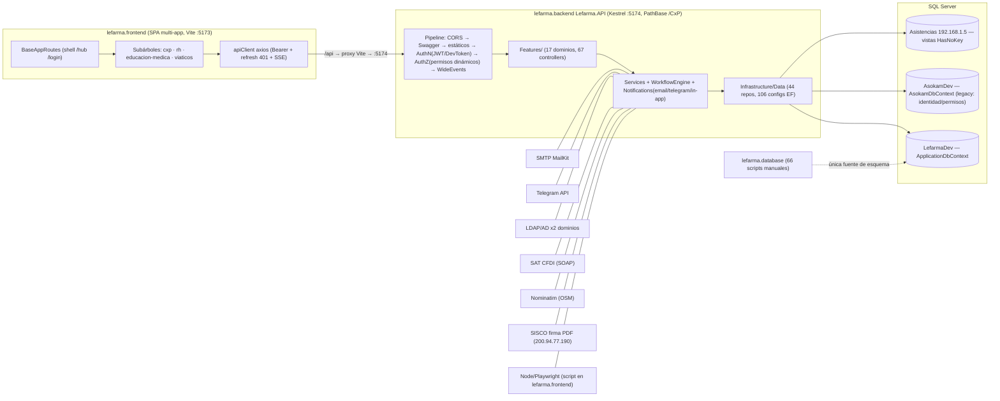

# 01 — Mapa de Arquitectura y Dependencias

| Campo | Valor |
|---|---|
| **Autor** | arquitecto (Agent Team — análisis de solo lectura) |
| **Fecha** | 2026-10-09 |
| **Alcance** | lefarma.backend (.NET 10, Lefarma.API), lefarma.frontend (React 19 + Vite 7 + TS 5.9), lefarma.database (scripts SQL manuales), lefarma.docs |
| **Versión analizada** | VERSION 1.3.0 / VERSION-STAGING 1.1.2-rc.3 |
| **Método** | Lectura directa de fuentes + codegraph (blast radius) + glob/grep. Sin builds ni despliegues. |

## Resumen ejecutivo

Lefarma es un monorepo con cuatro áreas: un backend ASP.NET Core 10 de **proyecto único** (`Lefarma.API`, 724 archivos .cs, 67 controladores en 17 dominios bajo `Features/`), un frontend SPA **multi-app** (shell `baseapp` + 4 subárboles: cxp, rh, educacion-medica, viaticos; 422 archivos .ts/.tsx), una base de datos gestionada por **scripts SQL manuales numerados** (66 scripts, sin EF migrations) y documentación extensa (146 .md).

El backend sigue una arquitectura "clean-ish" de 4 carpetas (Features / Infrastructure / Domain / Shared) con patrón repositorio (44 repositorios, 106 configuraciones EF, 118 entidades) y un **composition root monolítico** (`Program.cs`, 624 líneas, ~150 registros DI manuales). Conviven **tres DbContext** contra tres bases: `ApplicationDbContext` (Lefarma, negocio nuevo), `AsokamDbContext` (legacy Asokam: identidad, roles, permisos — **89 sitios de uso**, incluido todo el flujo de autenticación) y `AsistenciasDbContext` (solo vistas de solo lectura, HasNoKey). La autorización es dinámica (permisos desde BD sin reinicio) vía `DynamicPermissionPolicyProvider`.

El frontend consume la API por un cliente axios centralizado con refresh de token en interceptor; en desarrollo el proxy de Vite apunta `/api` → `http://localhost:5174`, aunque `VITE_API_URL` ya es absoluta, lo que vuelve redundante el proxy. Integraciones externas: SMTP (MailKit), Telegram, LDAP/Active Directory (2 dominios), SAT (validación CFDI por SOAP), Nominatim (geocodificación), SISCO/Asokam (firma de PDF, IP pública 200.94.77.190) y un runner de Playwright (Node) que el backend ejecuta desde la carpeta del frontend.

Las debilidades estructurales principales: **secretos de desarrollo commiteados** en `appsettings.json` (BD, JWT, SMTP, MasterPassword, ApiKey, EncryptionKey), **CORS AllowAnyOrigin** con la lista `Cors:AllowedOrigins` configurada pero sin uso, **Swagger habilitado sin guarda de ambiente**, numeración de scripts SQL inconsistente (números duplicados y un script suelto en la raíz del repo), acoplamiento profundo con el legacy Asokam, y **deriva documental** en AGENTS.md (referencia `src/routes/AppRoutes.tsx`, `init.ps1` y un seeder comentado que ya no existen).

## Hallazgos

### H1. Estructura del monorepo y artefactos en la raíz

Cuatro áreas formales (`lefarma.backend`, `lefarma.frontend`, `lefarma.database`, `lefarma.docs`) más tooling en la raíz: `multiappcli.ps1` (CLI de deploy), `playwright.config.ts`, `pnpm-workspace.yaml`, `VERSION`/`VERSION-STAGING`. La raíz también acumula artefactos sueltos: `sync_lefarmadev_a_lefarma.sql` (script de BD fuera de `lefarma.database/`), `nul`, `d.txt`, `_test_output.txt`, y carpetas `odd/` y `pruebas de gastos/`. Evidencia: listado de raíz del repo (2026-10-09).

### H2. Backend: proyecto único con capas "clean-ish"

Un solo proyecto compilable, `Lefarma.API.csproj` (net10.0, Nullable enable). Capas por convención de carpetas, no por proyectos separados:
- `Features/` — 17 dominios (Admin, Archivos, Auth, Catalogos, Config, Dashboard, EducacionMedica, Facturas, Firmas, Help, Logging, Notifications, OrdenesCompra, Profile, Rh, SystemConfig, Viaticos), 67 controladores.
- `Infrastructure/` — Data (DbContexts, 106 Configurations, 44 Repositories), Files (`AesFileCipher`), Filters (`ValidationFilter`), Middleware (`DevTokenMiddleware`, `WideEventLoggingMiddleware`), Services, Templates.
- `Domain/` — Entities (118 archivos), Interfaces, ValueObjects, Firmas.
- `Shared/` — Authorization, Constants, Errors, Extensions, Geography, Helpers, Logging, ModelBinders, Models.

Al no haber proyectos separados, **el compilador no exige la dirección de dependencias**: Features puede referenciar Infrastructure directamente (y lo hace, p. ej. `Program.cs:45-56` importa ambos). La disciplina de capas es por convención. Tests en solución `01-lefarma-project.sln`: `Lefarma.UnitTests`, `Lefarma.Tests`, `Lefarma.IntegrationTests`.

### H3. Composition root monolítico

`Program.cs` (624 líneas) registra manualmente ~150 servicios (repositorios `Program.cs:141-188`, Educación Médica `226-248`, catálogos `261-283`, notificaciones `306-321`), con bloques de código comentado (`370-383`) e indentación inconsistente (`242-244`, `293-295`). No hay assembly scanning ni módulos de extensión por feature (solo `AddActiveDirectoryServices`/`AddJwtTokenServices` en `289-290`). Cada feature nueva obliga a editar el mismo archivo — punto de colisión frecuente y riesgo de deriva.

### H4. Tres DbContext / tres bases de datos

Registro en `Program.cs:131-138`:
| DbContext | Connection string | Base (Development) | Rol |
|---|---|---|---|
| `ApplicationDbContext` (`Infrastructure/Data/ApplicationDbContext.cs:16`) | DefaultConnection | `192.168.4.2/LefarmaDev` | Negocio propio: catálogos, workflows (23 tablas), órdenes/pagos/comprobaciones, RH, Educación Médica, Viáticos, Help, Archivos, Notificaciones (~130 DbSets, `ApplicationDbContext.cs:24-154`) |
| `AsokamDbContext` (`AsokamDbContext.cs:8`) | AsokamConnection | `192.168.4.2/AsokamDev` | **Legacy de solo lectura (por convención)**: Usuarios/Roles/Permisos/Sesiones/RefreshTokens (schema `app`), Documentos, Hospitales, Productos (`AsokamDbContext.cs:15-32`) |
| `AsistenciasDbContext` (`AsistenciasDbContext.cs:6`) | AsistenciasConnection | **`192.168.1.5/Asistencias`** (`appsettings.Development.json:9`; en `appsettings.json:10` apunta a 192.168.4.2/AsistenciasDev) | Solo lectura estricto: 3 mapeos `HasNoKey().ToView()` — `vwEmpleados`, `vwEmpleadosYJefes`, `incidenciasChecado` (`AsistenciasDbContext.cs:16-18`) |

El esquema se gestiona **exclusivamente con SQL manual** en `lefarma.database/`; el csproj conserva la carpeta vacía `Infrastructure\Data\Migrations\` (`Lefarma.API.csproj:47`) pero no hay migrations EF.

### H5. Acoplamiento profundo con el legacy Asokam

Según codegraph, `AsokamDbContext` tiene **89 sitios de uso** (vs 23 de `AsistenciasDbContext`), incluidos `AuthService`, `RolCatalogService`, `UsuarioCatalogService`, `EnviosController` y +34 archivos más. La identidad y la autorización completas viven en la BD legacy: `UserPermissionService` (Scoped, acoplado a `AsokamDbContext`, `Program.cs:398-403`) y el `DevTokenMiddleware` consulta `AsokamDbContext.Usuarios` con roles/permisos (`DevTokenMiddleware.cs:59-67`). No existe una capa anticorrupción: las entidades legacy (`Domain.Entities.Asokam`, `Domain.Entities.Auth`) se consumen directamente desde servicios y controladores.

### H6. Autenticación y autorización

- **JWT Bearer** con clave simétrica desde `JwtSettings` (`Program.cs:330-347`); `ClockSkew = TimeSpan.Zero` (`Program.cs:346`) — intolerante a deriva de reloj. Expiración access token: 1200 min (producción) / 12000 min (Development, `appsettings.Development.json:20`).
- **Autorización dinámica**: sin políticas estáticas; `DynamicPermissionPolicyProvider` resuelve `HasPermission_*` al vuelo desde `app.Permisos` (`Program.cs:386-395`) y `PermissionHandler` las evalúa (`Program.cs:403`). Agregar un permiso en BD no requiere reinicio ni código.
- **LDAP/Active Directory** multi-dominio (Asokam 192.168.4.2, Artricenter 192.168.1.7, puerto 389) vía `System.DirectoryServices.Protocols` (`appsettings.json:45-62`, `Lefarma.API.csproj:36`), registrado con `AddActiveDirectoryServices` (`Program.cs:289`).
- **DevToken** (solo Development, doble guarda: registro `Program.cs:596-599` + `_isDevelopment` en `DevTokenMiddleware.cs:31-35`): el header `X-Dev-Token` impersona al usuario configurado. El token `lefarma-dev-token-2024` está commiteado en **`appsettings.json:2-5`** (base, no solo Development).
- Frontend: tokens en **localStorage** (`authService.ts:40-42`), refresh con cola de solicitudes en el interceptor 401 (`apiClient.ts:79-118`).

### H7. Integraciones externas

| Integración | Mecanismo | Evidencia |
|---|---|---|
| SMTP (mail.grupolefarma.com.mx:587) | MailKit 4.16 + `EmailSettings` con validación de opciones; `AcceptInvalidCertificates: true` | `appsettings.json:24-34`, `Program.cs:310-316`, `Lefarma.API.csproj:37` |
| Telegram | Canal de notificación keyed (`"telegram"`) con `ValidateOnStart()` activo — **falla el arranque si BotToken/ApiUrl faltan** | `Program.cs:319-328`, `appsettings.json:63-66` |
| SAT (CFDI) | SOAP `ConsultaCFDIService` vía HttpClient nombrado `"sat"` (timeout 15 s); en Development el endpoint está **roto a propósito** (`ConsultaCFDIServiceeeeeeeeee.svc`) | `Program.cs:118-121,191-194`, `appsettings.json:84-88`, `appsettings.Development.json:80` |
| Nominatim (OSM) | HttpClient nombrado con User-Agent identificable (exigencia de política OSM), timeout 12 s | `Program.cs:122-128` |
| SISCO / firma PDF Asokam | HTTP a IP pública `200.94.77.190:5074` con credenciales `sistemas` en claro | `appsettings.json:39-44` |
| Capturas de viáticos | Backend ejecuta un **script Node/Playwright alojado en lefarma.frontend** (`NodeCapturasScriptRunner`, Singleton) y copia los PNG a `wwwroot/media/capturas-viaticos` | `Program.cs:299-303,581-590` |
| SSE (notificaciones en tiempo real) | `ISseService`/`ISseTicketService` Singleton + `NotificationStreamController`; cliente en `services/sseService.ts` | `Program.cs:295-296`, `NotificationStreamController.cs:15-21` |

### H8. Logging observable (wide events)

Serilog 10 configurado al inicio del host (`Program.cs:78-114`): consola solo en Development, archivo **JSON** (`JsonFormatter`) en `logs/wide-events-.json` con rolling diario y retención de 30 archivos. Overrides agresivos para silenciar Microsoft/EF (`Program.cs:82-88`). Un middleware propio (`WideEventLoggingMiddleware`, `Program.cs:528`) emite un evento enriquecido por request; el logging automático de Serilog se neutraliza con `GetLevel => Fatal` (`Program.cs:520-525`). Además hay logging de negocio en BD: `ErrorLog`/`BusinessAuditLog` (`ApplicationDbContext.cs:127-128`, `Program.cs:286-287`).

### H9. Archivos estáticos y uploads

- Uploads de usuario: `ArchivosSettings.BasePath` (prod: `wwwroot/media/archivos`; dev: `C:\archivos`) servido en **`/api/media/archivos`** (`Program.cs:542-552`) y URL legacy **`/media/archivos`** (`Program.cs:555-565`), con headers no-cache.
- Imágenes de ayuda: `/api/media/help` (`Program.cs:570-579`).
- Capturas de viáticos: **guarda inline** que devuelve 404 para `/api/media/capturas-viaticos` y `/media/capturas-viaticos` ANTES del middleware estático (`Program.cs:497-513`); solo se sirven por endpoint autorizado `api/viaticos/capturas/{archivo}`.
- Cifrado de archivos privados: `IFileCipher`→`AesFileCipher` Singleton (`Program.cs:172`), clave en `ArchivosSettings.EncryptionKey` (`appsettings.json:75`).
- Límites de upload: 10 MB en FormOptions y Kestrel (`Program.cs:461-470`).
- SPA: `UseDefaultFiles`+`UseStaticFiles` (`Program.cs:517-518`) y `MapFallbackToFile("/index.html")` (`Program.cs:618`); `PathBase=/CxP` configurable (`Program.cs:474-478`, `appsettings.json:35-38`).

### H10. Pipeline HTTP y orden de middleware

`UsePathBase` → `UseCors` → Swagger (sin guarda) → `UseHttpsRedirection` → guarda capturas → estáticos → request logging → wide events → estáticos de media → `UseAuthentication` → `UseDevToken` (dev) → `UseAuthorization` → endpoints mínimos (`/api/health`, `/api/version`, anónimos, `Program.cs:603-612`) → `MapControllers` → fallback SPA (`Program.cs:472-620`). Los estáticos corren **antes** de autenticación: todo lo servido por `UseStaticFiles` es anónimo (el código lo reconoce y por eso existe la guarda de capturas).

### H11. Frontend: SPA multi-app con fábrica de rutas

`App.tsx:47-58` monta un único `BrowserRouter` con el shell `BaseAppRoutes`. Modelo "nav-reorg": `/` redirige (auth→`/hub`, no auth→`/login`), login global de 2 pasos, y 4 subárboles montados por función: `cxp`, `rh`, `educacion-medica`, `viaticos` (`BaseAppRoutes.tsx:47-133`). La infraestructura común (índice consciente de auth, wrapper de login, `ProtectedRoute`, `MainLayout`, NotFound) la aporta la fábrica `createAppRoutes.tsx` (`AppRoutesConfig`, `createAppRoutes.tsx:71-120`); CxP añade un 3er paso de ubicación (empresa/sucursal/área, `createAppRoutes.tsx:36-63`).

**Asimetría estructural**: `apps/rh`, `apps/viaticos` y `apps/educacion-medica` son autocontenidas (components/pages/services/types), pero `apps/cxp` no tiene carpetas propias — sus páginas viven en el árbol compartido `src/pages/` (admin, auth, catalogos, configuracion, help, ordenes, workflows) y sus servicios en `src/services/`. CxP es la app "legacy" del frontend.

### H12. Estado y formularios en el frontend

- **Zustand** es el store dominante: `src/store/` (configStore, helpStore, notificationStore, pageStore) + `shared/auth/authStore.ts:54` (`create<AuthState>`) + `shared/connection/connectionStore`.
- **Jotai** está incluido en package.json pero su uso real se limita a 2 componentes de kibo-ui (`components/kibo-ui/gantt/index.tsx:28`, `calendar/index.tsx:3`). La nota de AGENTS.md "Zustand + Jotai (mixed usage)" sobreestima a Jotai.
- Formularios: React Hook Form 7 + @hookform/resolvers + Zod 4. Tablas: TanStack Table 8. UI: shadcn/ui sobre Radix (56 componentes en `src/components/ui/`). Rich text: TinyMCE 8 (API key commiteada en `.env.development`).

### H13. Flujo backend ↔ frontend

```
Vite dev (5173) ──proxy /api──► http://localhost:5174 (Kestrel, launchSettings.json:8)
     │                                │
     └─ VITE_API_URL=http://localhost:5174/api (.env.development)
        → axios usa URL ABSOLUTA: el proxy de Vite queda sin efecto en dev
```
- `apiClient.ts:9`: `baseURL = import.meta.env.VITE_API_URL || '/api'` — como los .env fijan la URL absoluta, el proxy `vite.config.ts:47-52` solo serviría si `VITE_API_URL` estuviera vacía. Consecuencia: en dev las llamadas **no pasan por el proxy** y dependen de CORS (que es AllowAnyOrigin, por eso funciona).
- El interceptor de request inyecta `Bearer` (`apiClient.ts:33-54`); el de response maneja 401 con refresh + cola (`apiClient.ts:79-118`), detección de pérdida de conexión (2 fallos consecutivos o 502/503/504 → `connectionStore.markLost()`, `apiClient.ts:70-77`) y normalización a `ApiError`.
- Versionado quemado en build: backend lee `VERSION` y lo expone en `/api/version` (`Lefarma.API.csproj:8`, `Program.cs:606-612`); frontend lee `VERSION`/`VERSION-STAGING` según modo (`vite.config.ts:11-16`).
- Puerto real del backend: **5174** (launchSettings, proxy y .env coinciden); AGENTS.md documenta que `init.ps1` afirmaba 5134 — y ese archivo ya no existe (ver H16).

### H14. Dependencias NuGet (Lefarma.API.csproj:19-39)

| Paquete | Versión | Propósito | Criticidad |
|---|---|---|---|
| Microsoft.EntityFrameworkCore(.SqlServer/.Tools) | 10.0.2 | ORM de los 3 DbContext | **Alta** (corazón de datos) |
| Microsoft.AspNetCore.Authentication.JwtBearer | 10.0.2 | Auth JWT | **Alta** |
| Serilog.AspNetCore / Serilog.Expressions | 10.0.0 / 5.0.0 | Logging wide-event JSON | **Alta** (observabilidad) |
| FluentValidation (+DI Extensions) | 12.1.1 | Validación de DTOs con `ValidationFilter` | Alta |
| Swashbuckle.AspNetCore (+Annotations, +SwaggerUI) | 10.1.0/10.1.1 | Swagger/OpenAPI | Media |
| Microsoft.OpenApi / Microsoft.AspNetCore.OpenApi | 2.12.2 / 10.0.2 | Modelo OpenAPI | Media |
| MailKit | 4.16.0 | SMTP (notificaciones email) | Alta (canal crítico de aprobaciones) |
| System.DirectoryServices.Protocols | 9.0.0 | LDAP/AD multi-dominio | Alta (login corporativo) |
| Handlebars.Net | 2.1.6 | Plantillas de notificación | Media |
| CsvHelper | 33.0.1 | Import/export CSV (bulk proveedores) | Baja |
| ErrorOr | 2.0.1 | Resultados tipados en vez de excepciones | Baja (adopción parcial) |

Nota: `EFCore.Tools` está referenciado aunque el proyecto **no usa migrations** (H4) — peso muerto que además habilita accidentalmente `dotnet ef`.

### H15. Dependencias npm relevantes (package.json)

| Grupo | Paquetes | Propósito | Criticidad |
|---|---|---|---|
| Núcleo | react/react-dom 19.2, react-router-dom 7.13, vite 7.3, typescript 5.9.3 | Plataforma SPA | **Alta** |
| HTTP | axios 1.13 | Cliente API único (`apiClient.ts`) | **Alta** |
| Estado | zustand 5, jotai 2.18 | Stores globales (jotai: uso marginal, ver H12) | Alta / Baja |
| Formularios | react-hook-form 7.71, zod 4.3, @hookform/resolvers | Validación de formularios | Alta |
| UI | 27 paquetes @radix-ui + radix-ui, tailwindcss 3.4, class-variance-authority, clsx, tailwind-merge, lucide-react, shadcn (dev) | shadcn/ui | Alta |
| Tablas/gráficos | @tanstack/react-table 8, recharts 2.15, reactflow 11 (editor de workflows) | Datos y viz | Alta (CxP/workflows) |
| Rich text | tinymce 8 + @tinymce/tinymce-react | Editor de ayuda/artículos | Media |
| PDF/export | jspdf + jspdf-autotable, pdfmake, html2pdf.js + html-to-pdfmake + html2canvas, papaparse, xlsx (tarball CDN sheetjs) | Exportes | Media — **3 stacks de PDF redundantes** |
| Mapas | leaflet 1.9 + react-leaflet 5 | Viáticos (rutas/geocodificación) | Media |
| Notificaciones UI | sonner 2 **y** react-hot-toast 2.6 | Toasts | **Duplicados** (authStore usa sonner, `authStore.ts:15`) |
| Iconos | lucide-react **y** react-icons 5.5 | Iconos | **Duplicados** |
| Varios riesgo | @faker-js/faker en `dependencies` (debería ser dev), xlsx instalado desde URL de CDN (`package.json:107`), dnd-kit, embla-carousel, vaul, cmdk, shiki (~600 KB gzip, chunk propio en `vite.config.ts:37`), @lucasmarkes/hairline, tunnel-rat | — | Media (superficie de supply-chain y bundle) |
| Testing | vitest 3 + testing-library + jsdom (unit), @playwright/test 1.58 (e2e con scripts `test:e2e`, `package.json:18-19`) | Pruebas | Media |

### H16. Deriva documental (AGENTS.md vs código real)

Tres referencias de AGENTS.md ya no existen en el repo:
1. **`src/routes/AppRoutes.tsx`**: no existe; `src/routes/` solo contiene `LandingRoute.tsx`. El mapa real está en `BaseAppRoutes.tsx` + `apps/*/[X]Routes.tsx` + `shared/router/createAppRoutes.tsx` (H11). La propia tarea del tablero y AGENTS.md apuntan al archivo viejo.
2. **`init.ps1`**: no existe en ninguna parte del repo (glob `**/init.ps1` = 0 resultados); el arranque/deploy ahora pasa por `multiappcli.ps1` y `deploy/`.
3. **Seeder comentado en Program.cs**: grep `seed` en `Program.cs` = 0 coincidencias; el seeder desapareció del composition root.
Además, AGENTS.md afirma que Playwright no tiene scripts cableados, pero `package.json:18-19` define `test:e2e` y `test:e2e:login`. Riesgo: agentes y nuevos desarrolladores siguiendo rutas muertas.

### H17. Base de datos: scripts manuales con numeración inconsistente

66 scripts en tres ubicaciones: raíz de `lefarma.database/` (026–040), `legacy/` (000–031 + `06_`/`06B_`) y por módulo (`educacion-medica/`, `viaticos/` con prefijo timestamp). Problemas verificables:
- **Números duplicados con contenido distinto**: tres `027_*` en la raíz (`027_agregar_ajuste_redondeo_partidas.sql`, `027_agregar_campos_entrega_ordenes_compra.sql`, `027_alter_usuario_detalle_firma_control.sql`), dos `029_*` (`029_sp_cancelar_orden.sql`, `029_sincronizar_esquema_lefarma_a_lefarmadev.sql`), `031` tanto en raíz como en legacy, dos `025_` y dos `005_`×4 en legacy.
- **Huecos**: sin 024/030 coherentes, `038` ausente; en educacion-medica existe `9999_..._drop-schema-reset` (script destructivo conviviendo con los demás).
- **Scripts fuera de lugar**: `sync_lefarmadev_a_lefarma.sql` en la raíz del repo (H1).
- No hay manifest/registro de aplicación: el orden real es cronológico por nombre de archivo, no alfabético (AGENTS.md lo advierte). El esquema EF (Configurations) y el esquema SQL pueden divergir sin que nada lo detecte.

### H18. Configuración y secretos

Todo el secreto de desarrollo está commiteado en `appsettings.json` (y duplicado en `appsettings.Development.json`): contraseñas de las 3 BD (`:7-10`), `Auth.MasterPassword`/`Auth.ApiKey` (`:12-16`), JWT SecretKey (`:18`), SMTP password (`:28`), `ArchivosSettings.EncryptionKey` (`:75`), credenciales SISCO (`:42-43`), DevToken (`:2-5`). AGENTS.md los declara "local only", pero estructuralmente no hay separación de secretos (user-secrets, variables de entorno o vault) y `AcceptInvalidCertificates: true` (`:32`) debilita TLS del SMTP. `AllowedHosts: "*"` (`:98`).

### H19. CORS permisivo y configuración muerta

`Program.cs:438-447` registra `AllowAnyOrigin().AllowAnyHeader().AllowAnyMethod()`. La sección `Cors:AllowedOrigins` de `appsettings.json:99-104` **no la lee nadie** (grep de su uso = solo el literal "CorsPolicy" en `Program.cs:481`): configuración muerta que sugiere una restricción que no existe. Combinado con Swagger sin guarda (`Program.cs:483-493`, el `if (IsDevelopment)` está comentado) y `UseHttpsRedirection`, la superficie expuesta en cualquier ambiente es mayor de la que la configuración aparenta.

### H20. Versionado inconsistente entre canales

`VERSION = 1.3.0` y `VERSION-STAGING = 1.1.2-rc.3`: la base de staging (1.1.2) va **dos minors atrás** de productivo (1.3.0), contradiciendo la regla de AGENTS.md ("staging toma la base nueva con -rc.1"). Los `.env` traen `VITE_APP_VERSION` fijos (1.0.0/1.0.1) aunque el build los sobrescribe desde VERSION (`vite.config.ts:11-16`).

### H21. Acoplamiento backend→frontend por Playwright

El runner de capturas de viáticos (`NodeCapturasScriptRunner`, Singleton, `Program.cs:302`) ejecuta un script Node/Playwright que vive en `lefarma.frontend/scripts/` y escribe en `lefarma.frontend/public/capturas/viaticos/` (`Program.cs:581-583`; `package.json:16` tiene `test:captura-viaticos`). El backend depende en runtime de la instalación npm del frontend — cruce de fronteras de despliegue que no está contenido en ningún contrato (la whitelist de dominios viene vacía en `CapturasSettings`, `appsettings.json:79-83`).

### H22. Fortalezas estructurales (síntesis)

1. Organización por dominio en `Features/` consistente y navegable (17 dominios, 67 controllers con patrón uniforme Controller→Service→Repository→DbContext).
2. Autorización por permisos dinámica sin reinicio (`DynamicPermissionPolicyProvider`, `Program.cs:386-395`) — poco común y bien documentada en el código.
3. Fábrica de rutas frontend (`createAppRoutes.tsx`) que estandariza auth/login/layout por app y evita duplicar infraestructura.
4. Cliente HTTP único con refresh de token en cola, detección de caída de conexión y normalización de errores (`apiClient.ts`).
5. Observabilidad deliberada: wide events JSON por request + bitácoras de negocio en BD.
6. Defensa en profundidad para archivos: cifrado AES de privados, guarda 404 de capturas antes de estáticos, endpoint autorizado exclusivo.
7. Aislamiento de bases por DbContext con intencionalidad explícita (Asistencias solo vistas HasNoKey).
8. Suite de tests en 3 proyectos + vitest/playwright en frontend; `InternalsVisibleTo` para unit tests (`Lefarma.API.csproj:43`).

### Diagrama de arquitectura (mermaid)



## Prioridades

1. **Gestionar secretos fuera del repo** (H18, H6): mover contraseñas de BD/JWT/SMTP/EncryptionKey/DevToken a user-secrets o variables de entorno; hoy están commiteados en `appsettings.json` y `appsettings.Development.json`, con `AcceptInvalidCertificates: true` y CORS `AllowAnyOrigin` (H19) amplificando el riesgo.
2. **Crear una capa anticorrupción sobre Asokam** (H5): 89 sitios de uso directo de `AsokamDbContext` — empezar por identidad (`AuthService`, `UserPermissionService`, `DevTokenMiddleware`) con interfaces propias para que el legacy sea reemplazable sin tocar 34+ archivos.
3. **Normalizar la base de datos manual** (H17): renumerar/deduplicar scripts (tres 027, dos 029, 031 duplicado), mover `sync_lefarmadev_a_lefarma.sql` a `lefarma.database/`, aislar el `9999_drop-schema-reset` y añadir un manifest de aplicación que permita verificar esquema SQL vs modelo EF.
4. **Descomponer el composition root y limpiar configuración muerta** (H3, H19, H14): extraer registros DI por módulo (extension methods por feature), quitar `EFCore.Tools` (no hay migrations), y alinear CORS con `Cors:AllowedOrigins` (hoy decorativo) y Swagger con guarda de ambiente.
5. **Corregir la deriva documental y de versionado** (H16, H20): actualizar AGENTS.md (AppRoutes.tsx → `BaseAppRoutes.tsx`/`createAppRoutes.tsx`; init.ps1 → multiappcli.ps1; seeder eliminado; scripts de Playwright ya cableados) y reconciliar `VERSION-STAGING` (1.1.2-rc.3) con `VERSION` (1.3.0) según la regla de publicación vigente.
