# Diagrama de proceso y documentación del proceso de ventas Descentralizado

> Fuente: `pdf/Ventas/Diagrama Ventas Descentralizado.pdf`
> Código: ASK-VEN-DPD-002 · Versión: 01
> Proceso: Ventas Descentralizados · Área: Comercial
> Tipo de documento: Diagrama del proceso y la documentación

> ℹ️ **Fidelidad:** Los errores ortográficos del PDF origen se conservan tal cual (`dirario` por *diario*, `Mejia` por *Mejía*, `Hector Velez` sin acentos, `Autorizacion`, `estadistico`, `reporto`, `llego`, `i en el proceso` por *y*). El documento se titula *"Ventas Descentralizado"* y el proceso *"Ventas Descentralizados"* en el propio PDF; ambas lecturas se respetan.

## Etapas del proceso

1. **Etapa 1: Planea** (mensualmente)
2. **Etapa 2: Ejecuta** (visita por unidad médica)
3. **Etapa 3: Verifica** (Reporte semanal)
4. **Etapa 4: Mejora** (semanal y mensual)

## Responsables (abreviaturas)

| Abrev. | Responsable |
|--------|-------------|
| DC | Director corporativo |
| GG | Gerente general Asokam |
| GV-D | Gerente de ventas descentralizados |
| GRI | Gerente de relaciones institucionales |
| EV-D | Ejecutivo de ventas descentralizados |
| EE | Ejecutivo estadístico |
| CA | Coordinador administrativo |
| M-GPS | Monitorista GPS |
| EP | Especialista de producto |
| CQ | Control de quejas |
| TECNO | Tecnovigilancia |

## Documentos relacionados

| Código | Tipo | Nombre |
|--------|------|--------|
| LEF-CAL-PNO-003 | Procedimiento Norma Procedimiento Normalizado operativo | Procedimiento Normalizado operativo del proceso de quejas |
| ASK-VEN-IDT-001 | Instructivo de trabajo | Instructivo de trabajo para elaborar el plan de trabajo. |
| ASK-VEN-IDT-002 | Instructivo de trabajo | Instructivo de trabajo para visitar las unidades médicas |
| ASK-VEN-IDT-003 | Instructivo de trabajo | Instructivo de trabajo para reportar desplazamiento y venta. |
| ASK-VEN-FOR-001 | Formatos | Objetivos de ventas |
| ASK-VEN-FOR-002 | Formatos | Plan mensual de trabajo |
| ASK-VEN-FOR-003 | Formatos | Reporte de visitas dirario |
| ASK-ADM-FOR-001 | Formatos | Solicitud de viáticos |
| ASK-VEN-DOE-001 | Formatos | Formato de reporte de incidente (Formato de Lefarma) |

## Diagrama de flujo

```mermaid
flowchart TD
    INICIO([INICIO])

    subgraph E1 [Etapa 1 · Planea mensualmente]
        P1["GV-D: Informa y envía a los ejecutivos los objetivos,
            la distribución del presupuesto y estrategias de ventas
            y mercadotecnia con base al plan anual Asokam."]
        P2["EV-D: Elabora y entrega el plan de trabajo y solicitud
            de viáticos los días 15 de cada mes."]
        P3["GV-D: Recibe el plan de trabajo y solicitud de viáticos
            para su revisión, autorización y envío al Coordinador
            Administrativo."]
        P4["CA: Inicia con el proceso de viáticos de acuerdo
            a política vigente."]
    end

    subgraph E2 [Etapa 2 · Ejecuta visita por unidad médica]
        V0["EV-D: Registra el inicio de la visita por medio de la
            plataforma móvil autorizado por ASOKAM en apego al plan
            de trabajo mensual."]

        VMED["EV-D: Visita área médica
              (Jefe de anestesiología, Médico adscrito, Jefe quirófano,
              Residentes, Jefatura de enfermería)"]
        VMED2["EV-D: Da información/promoción de productos nuevos,
               entrega material y muestras, visita médicos del Club de
               Anestesiología, levanta y da seguimiento a quejas,
               gestiona inclusión en cuadro básico y licitaciones,
               atiende inquietudes, identifica apoyo técnico/médico,
               coordina visitas de EP."]
        EPQ{¿Se requiere EP?}
        EP["EP: Realiza visitas de asesoramiento, formación y apoyo
            técnico (uso y aplicaciones de productos, soporte a quejas,
            sesiones médicas, dudas)."]
        VMED3["EV-D: Recaba productividad en quirófano y actualiza
               fichero médico. Formato de encuestas de satisfacción."]
        QJ{¿Se reporto una queja?}
        QJ1["EV-D: Llena y envía formato Reporte de Incidente a
              Tecnovigilancia, Gerente de ventas descentralizado y
              Control de quejas Asokam. Da seguimiento."]
        PQ[/PROCESO DE QUEJAS/]

        VADM["EV-D: Visita área administrativa (Jefe de adquisiciones)"]
        VADM2["EV-D: Atiende inquietudes del personal administrativo,
               da seguimiento a quejas, monitorea existencias y
               desplazamientos y los reporta semanalmente."]
        VADM3["EV-D: Recaba desplazamientos, existencias y promoción/
               difusión de las marcas."]

        VFIN["EV-D: Registra conclusión de la visita en la plataforma
              móvil utilizada por el personal de Asokam en apego al
              plan de trabajo mensual."]
    end

    subgraph E3 [Etapa 3 · Verifica reporte semanal]
        R1["MGPS: Descarga y envía semanalmente los días jueves el
            reporte que genera la plataforma de GPS al Gerente de
            ventas y Ejecutivo de estadística."]
        R2["GV-D: Envía reporte el día lunes de cada semana con los
            desplazamientos realizados. Recibe y procesa información
            para que se envié al Ejecutivo estadistico."]
        R3["EE: Recibe y actualiza los indicadores de ventas cada
            semana."]
        R4["GV: Supervisa el cumplimiento por parte de los ejecutivos
            (plan de trabajo, actividades, estrategias) vía
            acompañamiento en campo, reporte de Control AT&T y
            llamada/Zoom."]
    end

    subgraph E4 [Etapa 4 · Mejora semanal y mensual]
        M1["GG, GV, DC, EE, GRI: Presentan al Director corporativo
            los días martes de cada semana los indicadores de ventas."]
        OBJ{¿Se llego al objetivo mensual?}
        M2["CA: Solicita al final del mes comisiones de acuerdo a
            la política vigente."]
        M3["GV-D: Replantea estrategias de ventas en el plan de trabajo."]
    end

    FIN([FIN])

    INICIO --> P1 --> P2 --> P3 --> P4 --> V0
    V0 --> VMED --> VMED2 --> EPQ
    EPQ -- SI --> EP --> VMED3
    EPQ -- NO --> VMED3
    VMED3 --> QJ
    QJ -- SI --> QJ1 --> PQ
    QJ -- NO --> VADM
    PQ --> VADM
    VADM --> VADM2 --> VADM3 --> VFIN
    VFIN --> R1 --> R2 --> R3 --> R4 --> M1 --> OBJ
    OBJ -- SI --> M2 --> FIN
    OBJ -- NO --> M3 --> FIN
```

## Firmas

| Puesto | Nombre | Rol | Fecha |
|--------|--------|-----|-------|
| Gerente de ventas Descentralizados | Lic. Gerardo Muñoz Padilla | ELABORÓ | 02-Nov-2021 |
| Analista de métodos y procedimientos | Ing. Omar Castro Mejia | ELABORÓ | 02-Nov-2021 |
| Gerente de calidad | QFB. Daniel Gasca Hinojosa | REVISÓ | 02-Nov-2021 |
| Gerente general | Lic. Luis Antonio Pozo Urquizo | REVISÓ | 02-Nov-2021 |
| Director corporativo | Lic. Héctor de Jesús Vélez Rivera | AUTORIZÓ | 01-11-2021 |

### Firma digital (validación del PDF)

| Campo | Valor |
|-------|-------|
| Nombre | Lic. Hector Velez |
| Motivo | Autorizacion |
| Fecha | 16/11/2021 10:13:06 a. m. (UTC-06:00:00) |
