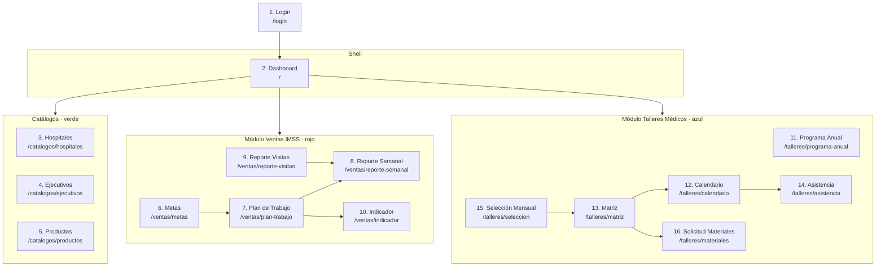

# Pantallas — App Educación Médica

> Wireframes: [`pantallas.excalidraw`](./pantallas.excalidraw)
> Documentación fuente: [`extracted/`](./extracted/) y [`vault/`](./vault/)
> Procesos cubiertos: **Talleres Médicos en Hospitales** (Educación Médica) y **Ventas IMSS** (Ventas)

Este documento describe las **16 pantallas** que componen la app, su mapa de navegación, los elementos clave de cada una, el formulario/instructivo de origen (código `ASK-*`) y la matriz de roles con permisos. Cada pantalla tiene una contrapartida visual (frame) en el archivo `.excalidraw`, codificada por color según el módulo.

---

## Convenciones

- **CRUD** = Crear / Leer / Actualizar / Eliminar (gestión completa del registro).
- **R** = Solo lectura (consulta).
- **R/W** = Lectura + captura/edición de su propio ámbito.
- **A** = Aprobación / autorización (firma del flujo).
- **—** = Sin acceso.
- Los códigos `ASK-CEM-FOR-*` corresponden a formularios de **Educación Médica**; `ASK-VEN-FOR-*` a **Ventas**; `ASK-CEM-IDT-*` / `ASK-VEN-IDT-*` a instrucciones de trabajo; `ASK-KPI-*` a indicadores.

---

## Mapa de navegación

**Leyenda de flujo de negocio (resumen):**

- **Ventas IMSS:** Metas → Plan de Trabajo → Visitas (Reporte) → Reporte Semanal → Indicador de Cumplimiento.
- **Talleres Médicos:** Selección mensual de hospitales → Matriz de Talleres → Calendario → Solicitud de Materiales → Impartición (Asistencia).

---

## Inventario de pantallas

### Auth

#### 1. Login

- **Ruta:** `/login`
- **Propósito:** Autenticar al usuario (usuario + contraseña) contra el directorio (LDAP/Active Directory) y emitir el JWT de sesión. Pantalla de acceso único a toda la app.
- **Elementos clave:** Tarjeta centrada con logo de Grupo Lefarma/Asokam, saludo "Bienvenido", campo **Usuario**, campo **Contraseña**, botón **Entrar**. Enlace de recuperación de contraseña.
- **Documento origen:** — (pantalla del sistema; reutiliza la autenticación LDAP/JWT del backend Lefarma).
- **Roles:** Todos (acceso público previo a autenticación).

---

### Shell

#### 2. Layout / Dashboard

- **Ruta:** `/`
- **Propósito:** Shell principal de la aplicación. Contiene la **barra lateral** (sidebar) con la navegación agrupada por módulo, la **barra superior** (topbar) con usuario, rol y notificaciones, y un **área de contenido** con KPIs resumidos.
- **Elementos clave:**
  - **Sidebar** con secciones: *Catálogos* (Hospitales, Ejecutivos, Productos), *Ventas IMSS* (Metas, Plan de Trabajo, Indicador), *Talleres Médicos* (Programa, Calendario).
  - **Topbar:** avatar del usuario, rol activo, iconos de notificación.
  - **Área de contenido:** tarjetas KPI (cumplimiento de plan, talleres del mes) y una gráfica/tabla principal configurable.
- **Documento origen:** — (navegación del sistema).
- **Roles:** Todos los autenticados (el menú se filtra según permisos del rol).

---

### Catálogos

#### 3. Hospitales

- **Ruta:** `/catalogos/hospitales`
- **Propósito:** Mantener la **base de datos de hospitales** para talleres médicos y visitas de ventas: clave CLUES, ubicación, capacidad quirúrgica y cálculos derivados de anestesias.
- **Elementos clave:**
  - **Toolbar:** Nuevo, Importar, Editar, Eliminar, Exportar.
  - **Tabla** con columnas: CLUES, Nombre, Estado, Municipio, Clave Institución, N° de quirófanos, Anestesias (Totales/Generales/Regionales/Epidurales/Subdurales/Mixtas), Estatus.
  - **Cálculos automáticos** (según guía ASK-CEM-FOR-002): `AT = NQ × 2.5 × 250`, `AG = AT × 30%`, `AR = AT × 70%`, etc. El usuario captura N° de quirófanos y el sistema calcula el resto.
  - Filtros: Gerencia (IMSS/Descentralizado), Con/Sin SIA, Año.
- **Documento origen:** `ASK-CEM-FOR-002` Base de datos de Hospitales para Talleres Médicos.
- **Roles:** GG/GV: **CRUD** · AEM: **R/W** · EV/EP: **R**.

#### 4. Ejecutivos de Ventas

- **Ruta:** `/catalogos/ejecutivos`
- **Propósito:** Gestionar el catálogo de ejecutivos/representantes de ventas: a qué zona y gerencia pertenecen y su puesto jerárquico.
- **Elementos clave:**
  - **Toolbar:** Nuevo, Editar, Eliminar, Importar.
  - **Tabla** con columnas: Nombre, Zona/Región, Puesto (**Gerente General / Gerente de Ventas / Ejecutivo de Ventas / Especialista de Producto**), Gerencia (IMSS/Descentralizado), Estatus.
  - Filtro por gerencia y región.
- **Documento origen:** Estructura organizacional derivada de los roles de `Roles y Abreviaturas` (GV, EV, EP) y responsables de `ASK-VEN-FOR-001` / `ASK-CEM-FOR-005`.
- **Roles:** GG: **CRUD** · CA: **R/W** · GV: **R** · EV: **R (propio)**.

#### 5. Productos

- **Ruta:** `/catalogos/productos`
- **Propósito:** Mantener el catálogo de productos Asokam que se promocionan, desplazan y llevan a talleres, con su clasificación comercial.
- **Elementos clave:**
  - **Toolbar:** Nuevo, Importar, Editar, Eliminar.
  - **Tabla** con columnas: Clave, Nombre (p. ej. Raquimix II/III, Tesiakit, Dural Básico/III, Medimesh, Zpinum 27), **Tipo** (Nuevo / Tradicional), **Línea** (Dispositivos médicos / Equipos médicos), Estatus.
- **Documento origen:** Lista de productos referenciada en `ASK-VEN-FOR-001` (Metas) y `ASK-CEM-FOR-005` (Matriz, campo Producto).
- **Roles:** GG/CA: **CRUD** · GV/EV/EP: **R**.

---

### Módulo Ventas IMSS

#### 6. Metas de Ventas y Desplazamiento

- **Ruta:** `/ventas/metas`
- **Propósito:** Definir las **metas anuales de ventas y desplazamiento** por unidad de negocio, tipo de producto y mes, expresadas en **Pesos y Piezas**. Base del plan estratégico y de las revisiones trimestrales/semestrales.
- **Elementos clave:**
  - **Selectores:** Año, Unidad de negocio (**IMSS / Descentralizados / Privados**), Tipo de producto (**Dispositivos / Equipos médicos**), Responsable (**Gerente General / Gerente de Ventas / Ejecutivo de Ventas**), Región.
  - **Pestañas Pesos / Piezas.**
  - **Tablas editables** (grid Ene–Dic + Total):
    1. Metas por tipo de producto (Nuevo / Tradicional / Total).
    2. Metas por producto — Nuevo (3 filas) y Tradicional (4 filas) con subtotales y gran total.
  - Bloque de firmas (ELABORÓ / REVISÓ / ENTERADO / AUTORIZÓ).
- **Documento origen:** `ASK-VEN-FOR-001` Metas de Ventas y Desplazamiento.
- **Roles:** DC: **A** (autoriza) · GG: **CRUD** · GV: **R/W (su unidad)** · EV: **R (su región)** · EE: **R**.

#### 7. Plan de Trabajo Mensual

- **Ruta:** `/ventas/plan-trabajo`
- **Propósito:** Programar las **visitas mensuales** de cada ejecutivo a las unidades médicas, con tres bloques de visita diarios más comida, a lo largo de ~5 semanas.
- **Elementos clave:**
  - **Selectores:** Mes, Año, Ejecutivo, Región, Unidad de negocio.
  - **Grid semanal** (Lun–Dom) con fila de fecha por semana.
  - **Bloques de visita** (3/día + comida) con campos: Unidad médica, Dirección, Área/Departamento, Contacto, Objetivo de la visita, Hora de inicio, Hora de fin.
  - Horarios plantilla: Visita 1 (7:30–10:00), Visita 2 (11:15–14:00), Comida (14:00–15:00), Visita 3 (15:45–17:30).
  - Firmas: Elaboró (Ejecutivo) / Aprobó (Gerente de Ventas).
- **Documento origen:** `ASK-VEN-FOR-002` Plan de Trabajo (mensual).
- **Roles:** GV: **A** (aprueba) · EV: **R/W (propio plan)** · GG/EE: **R**.

#### 8. Reporte Semanal de Visitas

- **Ruta:** `/ventas/reporte-semanal`
- **Propósito:** Verificar el **cumplimiento del plan de trabajo** comparando, por ejecutivo y zona, las visitas programadas vs. realizadas durante la semana (Viernes a Jueves).
- **Elementos clave:**
  - **Selectores:** Semana (rango de fechas), Zona.
  - Indicador superior: **Cumplimiento al Plan de Trabajo [%]**.
  - **Tabla** por ejecutivo: Zona, y por día (Vie/Lun/Mar/Mié/Jue) columnas *N° Visitas Programadas* y *N° Visitas Realizadas*, más totales y **% de eficiencia**.
  - **Gráfica** Programadas vs. Realizadas (barras) y **% de cumplimiento** (radar).
  - Campo libre **Análisis semanal**.
- **Documento origen:** `ASK-VEN-FOR-004` Reporte semanal de visitas hospitalarias.
- **Roles:** EE: **R/W (captura/consolida)** · GV/GG: **R** · EV: **R (propio)**.

#### 9. Reporte de Visitas Médicas

- **Ruta:** `/ventas/reporte-visitas`
- **Propósito:** Registrar el **detalle de cada visita** a una unidad médica: personas entrevistadas, motivo, resultado y evaluación de desplazamiento de producto (lotes, existencias). Equivale al formato que hoy se llena vía Microsoft Forms.
- **Elementos clave:**
  - **Encabezado:** Ejecutivo, Fecha, Región, UMAE/Delegación.
  - **Persona 1 y Persona 2 visitadas:** tipo (Personal Médico / Administrativo), Nombre, Puesto, Motivo, Resultado.
  - **Evaluación de desplazamiento** (Sí/No) con hasta **2 productos**: Nombre, N° de lote, Fecha última revisión, Fecha de revisión, Cantidad desplazada, Existencia en almacén.
  - **Comentarios, sugerencias o quejas** (texto libre).
- **Documento origen:** `ASK-VEN-FOR-003` Reporte de Visitas Médicas.
- **Roles:** EV: **R/W (captura cada visita)** · GV/EE/CQ/TECNO: **R**.

#### 10. Indicador de Cumplimiento

- **Ruta:** `/ventas/indicador`
- **Propósito:** KPI anual de seguimiento al plan de trabajo: **visitas registradas (app) vs. programadas**, con meta 100% e intervalo de acción 95%–100%.
- **Elementos clave:**
  - **Selectores:** Unidad de negocio (IMSS/Descentralizados), Gerente, Ejecutivo, Región, Periodo evaluado.
  - **Definición del KPI** `ASK-KPI-VEN-001`: descripción, Meta (100%), Intervalo de acción (95%–100%), General (promedio anual).
  - **Tabla mensual Ene–Dic** con: Visitas programadas (meta fija 60/mes), Visitas registradas por semana (1–4), Meta (100%) y Cumplimiento.
  - **Gráfica de barras** anual (eje 0–120%): Visitas registradas / Cumplimiento / Visitas programadas.
  - Firmas: Ejecutivo, Gerente de Ventas, Elaboró, Revisó.
- **Documento origen:** `ASK-VEN-FOR-005` Indicador de Cumplimiento del Plan de Trabajo · KPI `ASK-KPI-VEN-001`.
- **Roles:** EE: **R/W (actualiza)** · GV/GG/DC: **R**.

---

### Módulo Talleres Médicos

#### 11. Programa Anual de Talleres

- **Ruta:** `/talleres/programa-anual`
- **Propósito:** Planificar el **programa anual de talleres médicos** por hospital/gerencia: periodos, hospitales objetivo, meta de talleres y productos a promocionar.
- **Elementos clave:**
  - **Selector:** Año.
  - **Tabla** con: Definición (objetivo), Inicio/Fin (periodo), Gerencia (IMSS/Descentralizado), Hospitales objetivo (Con/Sin SIA), N° de hospitales, **Meta al año** (`Meta = N° hospitales × 1.5`), Productos a promocionar (R-III, R-II, R-I, B-27G, B-22G, T) marcados con "x", Total.
  - **Resumen de capacidad:** Semanas de trabajo, Talleres/semana (`= Total / Semanas`), Talleres/especialista, Especialistas necesarios/disponibles/a contratar.
  - Firmas: Elaboró / Revisó / Autorizó.
- **Documento origen:** `ASK-CEM-FOR-003` Programa Anual de Talleres Médicos.
- **Roles:** GG: **A** · GV/CEM: **CRUD** · AEM: **R/W** · EV/EP: **R**.

#### 12. Calendario de Talleres

- **Ruta:** `/talleres/calendario`
- **Propósito:** Mostrar la **programación mensual de talleres** por día, especialista y ejecutivo. Lo elabora el Auxiliar Administrativo de Educación Médica el día 17 de cada mes.
- **Elementos clave:**
  - **Selectores:** Año, Mes.
  - **Vista calendario mensual** (columnas Lun–Dom; Sáb/Dom no laborables).
  - **Cards por día** con: Ciudad, Especialista de producto asignado, Ejecutivo de Ventas, Hospital y hora.
- **Documento origen:** `ASK-CEM-FOR-006` Calendario de Talleres Médicos.
- **Roles:** AEM: **CRUD (elabora)** · CEM/GG: **A** · GV/EP/EV: **R**.

#### 13. Matriz de Talleres

- **Ruta:** `/talleres/matriz`
- **Propósito:** Concentrar los **datos y costos de cada taller**: hospital, fecha, recursos solicitados (equipo de proyección, muestras, folletos, envío, box lunch) y autorizaciones del flujo.
- **Elementos clave:**
  - **Selector:** Gerencia (Centralizado/Descentralizado).
  - **Tabla de datos generales:** Región, Hospital, Estado, Ciudad/Municipio, N° participantes, Ejecutivo, Fecha, Hora.
  - **Tabla de recursos:** Equipo proyección (¿requiere? ¿propio/rentado?), Muestras (producto/cantidad), Folletos (cantidad/costo unitario/tipo), Gastos de envío, Box lunch.
  - **Resumen de costos** por recurso + Costo total.
  - **Sección de autorizaciones:** ELABORÓ (Ejecutivo), REVISÓ (Gerente de Ventas → Coordinador Administrativo), AUTORIZÓ (Dirección Corporativa) con puesto, nombre, firma y fecha.
- **Documento origen:** `ASK-CEM-FOR-005` Matriz de Talleres Médicos.
- **Roles:** EV: **R/W (captura)** · GV: **A (concentra/revisa)** · CA: **A (revisa costos)** · DC: **A (autoriza)** · AEM: **R/W**.

#### 14. Registro de Asistencia

- **Ruta:** `/talleres/asistencia`
- **Propósito:** Registrar la **asistencia al taller médico**: datos del evento y la lista firmada de los médicos participantes.
- **Elementos clave:**
  - **Encabezado:** Fecha, Tema del taller (producto), Institución, Unidad médica, Lugar, Especialista, Ejecutivo.
  - **Contador automático de asistencia.**
  - **Lista de asistencia** (hasta 20 filas): N°, Nombre, Puesto, Teléfono celular, Correo electrónico, Firma.
  - **Observaciones:** registrar el médico líder (positivo/negativo del producto).
- **Documento origen:** `ASK-CEM-FOR-008` Registro de Asistencia.
- **Roles:** EP/EV: **R/W (captura en sitio)** · AEM/GV: **R**.

#### 15. Selección Mensual de Hospitales

- **Ruta:** `/talleres/seleccion`
- **Propósito:** Apoyar la **reunión del día 15** en la que el Gerente General y los Gerentes de Ventas seleccionan los hospitales a visitar en los próximos 45 días, aplicando los criterios de priorización.
- **Elementos clave:**
  - **Selectores:** Gerencia, Mes.
  - **Lista de hospitales elegibles** con: Región, Hospital, Estado, Ejecutivo, Producto a promocionar, Prioridad, Observaciones, y casilla de selección.
  - **Criterios de selección (indicados en UI):** valor de mercado y ubicación; agrupación por zonas (**mín. 4 hospitales/viaje**); meta de **≥64 talleres/mes** en IMSS e igual en Descentralizados; preferencia por hospitales sin taller en el año o con más tiempo desde el último.
  - Botón **Autorizar** (firma del flujo Elaboró/Revisó/Autorizó).
- **Documento origen:** `ASK-CEM-IDT-003` (Selección mensual de hospitales) · formato `ASK-CEM-FOR-004`.
- **Roles:** GG: **A** · GV: **R/W (selecciona)** · EV: **R (recibe asignación)** · AEM: **R**.

#### 16. Solicitud de Materiales

- **Ruta:** `/talleres/materiales`
- **Propósito:** Gestionar la **solicitud y entrega del material** para los talleres (producto, folletos, registro de asistencia, dulces, equipo de cómputo/proyector) y confirmar la recepción por el ejecutivo.
- **Elementos clave:**
  - **Selectores:** Taller, Hospital, Ejecutivo.
  - **Tabla de materiales:** N°, Fecha, Hospital, Cargo/Puesto, Producto, Cantidad, Lista de asistencia (Sí/No), Flayers, Equipo de cómputo (Sí/No), Proyector (Sí/No), Dulces (Sí/No), Modelo anatómico (Sí/No), **Estatus de entrega**, Observaciones.
  - **Coordinación de entrega:** CDMX (4:30–6:30 p.m.) o Foránea (paquetería, 7 días antes, carta porte).
  - **Firma de recibido** del Ejecutivo (formato `ASK-CEM-FOR-007`).
- **Documento origen:** `ASK-CEM-IDT-004` (Solicitud y entrega de materiales) · formato `ASK-CEM-FOR-007`.
- **Roles:** AEM: **CRUD (gestiona)** · CA/Aux. Almacén: **R/W (pedido interno)** · EV: **R/W (recibe/confirma)** · GG/DC: **R**.

---

## Matriz de roles por pantalla

> Leyenda: **CRUD** · **R/W** · **R** · **A** (aprueba/autoriza) · **—** (sin acceso).
> "propio" = limitado al ámbito del propio ejecutivo/región.

| # | Pantalla | Director Corp. (DC) | Gerente General (GG) | Gerente Ventas (GV) | Ejecutivo Ventas (EV) | Especialista Producto (EP) | Aux. Admin. Ed. Médica (AEM) | Coord. Admin. (CA) | Ejec. Estadística (EE) |
|---|----------|:---:|:---:|:---:|:---:|:---:|:---:|:---:|:---:|
| 1 | Login | ✓ | ✓ | ✓ | ✓ | ✓ | ✓ | ✓ | ✓ |
| 2 | Dashboard | R | R | R | R | R | R | R | R |
| 3 | Hospitales | R | CRUD | CRUD | R | R | R/W | R/W | R |
| 4 | Ejecutivos | R | CRUD | R | R (propio) | R (propio) | R | R/W | R |
| 5 | Productos | R | CRUD | R | R | R | R | CRUD | R |
| 6 | Metas Ventas | A | CRUD | R/W | R (propio) | — | — | R | R |
| 7 | Plan Trabajo | R | R | A | R/W (propio) | — | — | R | R |
| 8 | Reporte Semanal | R | R | R | R (propio) | — | — | R | R/W |
| 9 | Reporte Visitas | R | R | R | R/W | — | — | R | R |
| 10 | Indicador | R | R | R | R | — | — | R | R/W |
| 11 | Programa Anual | A | A | CRUD | R | R | R/W | R | R |
| 12 | Calendario | R | A | R | R | R | CRUD | R | R |
| 13 | Matriz Talleres | A | R | A | R/W | R | R/W | A | R |
| 14 | Asistencia | R | R | R | R/W | R/W | R | R | R |
| 15 | Selección Mensual | A | A | R/W | R | R | R | R | R |
| 16 | Solicitud Materiales | R | R | R | R/W | R | CRUD | R/W | R |

> Notas: El rol **DC (Director Corporativo)** aparece como autoridad final de autorización en los flujos de firma (Metas, Matriz, Programa Anual, Selección). El **Monitorista GPS** y **Tecnovigilancia/Control de Quejas** tienen acceso de solo lectura a los reportes que les competen (visitas e incidentes), no se listan como gestores de captura.

---

## Catálogo de formularios origen

Relación entre los códigos `ASK-*` de la documentación de negocio y las pantallas que los digitalizan.

| Código | Formulario / Instructivo | Proceso | Pantalla |
|--------|--------------------------|---------|----------|
| ASK-CEM-FOR-002 | Base de datos de Hospitales para Talleres Médicos | Educación Médica | #3 Hospitales |
| ASK-CEM-FOR-003 | Programa Anual de Talleres Médicos | Educación Médica | #11 Programa Anual |
| ASK-CEM-FOR-004 | Selección de Hospitales para Talleres Médicos | Educación Médica | #15 Selección Mensual |
| ASK-CEM-FOR-005 | Matriz de Talleres Médicos | Educación Médica | #13 Matriz |
| ASK-CEM-FOR-006 | Calendario de Talleres Médicos | Educación Médica | #12 Calendario |
| ASK-CEM-FOR-007 | Material para Talleres Médicos | Educación Médica | #16 Solicitud Materiales |
| ASK-CEM-FOR-008 | Registro de Asistencia | Educación Médica | #14 Asistencia |
| ASK-CEM-IDT-003 | Selección Mensual de Hospitales (instrucción) | Educación Médica | #15 Selección Mensual |
| ASK-CEM-IDT-004 | Solicitud y Entrega de Materiales (instrucción) | Educación Médica | #16 Solicitud Materiales |
| ASK-VEN-FOR-001 | Metas de Ventas y Desplazamiento | Ventas | #6 Metas |
| ASK-VEN-FOR-002 | Plan de Trabajo (mensual) | Ventas | #7 Plan de Trabajo |
| ASK-VEN-FOR-003 | Reporte de Visitas Médicas | Ventas | #9 Reporte Visitas |
| ASK-VEN-FOR-004 | Reporte Semanal de Visitas | Ventas | #8 Reporte Semanal |
| ASK-VEN-FOR-005 | Indicador de Cumplimiento del Plan de Trabajo | Ventas | #10 Indicador |
| ASK-KPI-VEN-001 | KPI Cumplimiento del Plan de Trabajo | Ventas | #10 Indicador |
| ASK-TES-FOR-001 | Depósito Box Lunch (talleres) | Educación Médica | #13 Matriz (insumo) |

---

## Decisiones de diseño relevantes

- **Autenticación y shell reutilizados.** Login y Dashboard no tienen formulario `ASK-*` de origen: se apoyan en la autenticación LDAP/JWT y el patrón de layout del backend Lefarma ya existente. El menú del sidebar se filtra dinámicamente por permisos del rol.
- **Cálculos automáticos de hospitales.** En #3 Hospitales, las columnas de anestesias se calculan automáticamente a partir del N° de quirófanos según las fórmulas de la guía `ASK-CEM-FOR-002` (AT = NQ × 2.5 × 250, etc.), evitando captura manual propensa a error.
- **Pesos y Piezas en pestañas.** En #6 Metas, las tablas en Pesos y Piezas comparten selectores pero se presentan en pestañas para reducir la densidad de la cuadrícula (13 columnas Ene–Dic + Total por tabla).
- **Reporte de Visitas digitaliza Microsoft Forms.** La pantalla #9 reemplaza el formulario de Forms actual (liga de Office) por una captura nativa en la app, manteniendo los 19 campos exactos del formato `ASK-VEN-FOR-003`.
- **Flujos de firma modelados como estados.** Pantallas con autorizaciones (#6, #11, #13, #15) implementan el ciclo **Borrador → Elaboró → Revisó → Autorizó** como estados del registro, con transiciones controladas por rol (DC/GG/GV).
- **Calendario vs. Programa Anual.** Se separan #11 (planificación anual estratégica) y #12 (calendario operativo mensual del día 17) porque responden a instrucciones distintas (`ASK-CEM-FOR-003` y `ASK-CEM-FOR-006`) con responsables diferentes (GV/AEM).
- **Codificación visual por módulo en el wireframe.** Auth/Shell (amarillo), Catálogos (verde), Ventas IMSS (rojo/rosa), Talleres Médicos (azul), consistente con el código de color del `.excalidraw`.
