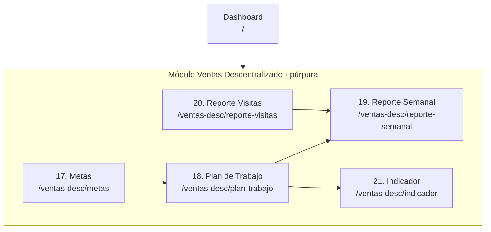

# Pantallas v2 — Módulo Ventas Descentralizado

> Wireframes: [`pantallas2.excalidraw`](./pantallas2.excalidraw)
> Continúa: [`pantallas.md`](./pantallas.md) (v1 — 16 pantallas: Auth, Shell, Catálogos, Ventas IMSS, Talleres Médicos)
> Documento de proceso origen: [`vault/Diagramas/Diagrama del Proceso de Ventas Descentralizado.md`](./vault/Diagramas/Diagrama%20del%20Proceso%20de%20Ventas%20Descentralizado.md) (`ASK-VEN-DPD-002`)

Este documento agrega el **módulo Ventas Descentralizado** (pantallas **17–21**), espejo del módulo Ventas IMSS (pantallas 6–10 de v1). El proceso descentralizado reutiliza los **mismos formularios** `ASK-VEN-FOR-*`, por lo que las pantallas comparten estructura; lo que cambia es la **mecánica del proceso**: responsables, plataforma de registro y cadencia del reporte semanal.

---

## Diferencias clave vs. Ventas IMSS

| Aspecto | Ventas IMSS (v1) | Ventas Descentralizado (v2) |
|---------|------------------|------------------------------|
| Gerente | GV-IMSS | **GV-D** (Gerente de Ventas Descentralizados) |
| Ejecutivo | EV-IMSS | **EV-D** (Ejecutivo de Ventas Descentralizados) |
| Registro de visita | App Control AT&T v1.35 | **Plataforma móvil autorizada por ASOKAM** |
| Reporte semanal de desplazamiento | GRI envía los **lunes** | **EE** envía los **lunes**; MGPS descarga GPS los **jueves** |
| Visita — área médica | Jefe anestesiología, Médico adscrito, Jefe Ceye/quirófano | + **Residentes** y **Jefatura de enfermería** |
| Visita — área administrativa | Jefe de almacén, Jefe de abasto | **Jefe de adquisiciones** |
| Foco comercial extra | Gestión de CPM | **Inclusión en cuadro básico y licitaciones** |
| Diagrama de proceso | `ASK-VEN-DPD-001` | `ASK-VEN-DPD-002` |

> Implicación de diseño: estas pantallas pueden implementarse como las **mismas vistas de Ventas** filtradas por *Unidad de negocio = Descentralizados*, o como un módulo paralelo. v2 las modela explícitas para reflejar el flujo y los responsables distintos.

---

## Mapa de navegación (módulo Descentralizado)



**Flujo de negocio:** Metas → Plan de Trabajo → Visitas (Reporte) → Reporte Semanal → Indicador de Cumplimiento — idéntico al de IMSS, ejecutado por GV-D/EV-D sobre la plataforma ASOKAM.

---

## Inventario de pantallas

### 17. Metas de Ventas y Desplazamiento (Descentralizado)

- **Ruta:** `/ventas-desc/metas`
- **Propósito:** Definir las metas anuales de ventas y desplazamiento de la **unidad de negocio Descentralizados** por tipo de producto y mes, en Pesos y Piezas.
- **Elementos clave:** Igual que #6, con **Unidad de negocio fija = Descentralizados**; selectores Año, Tipo de producto, Responsable (**GG / GV-D / EV-D**), Región; pestañas Pesos/Piezas; tablas editables Ene–Dic + Total; bloque de firmas.
- **Documento origen:** `ASK-VEN-FOR-001` · Diagrama `ASK-VEN-DPD-002`.
- **Roles:** DC: **A** · GG: **CRUD** · GV-D: **R/W (su unidad)** · EV-D: **R (su región)** · EE: **R**.

### 18. Plan de Trabajo Mensual — vista mensual (Descentralizado)

- **Ruta:** `/ventas-desc/plan-trabajo`
- **Propósito:** Vista de **overview** del plan: el EV-D ve sus visitas ya programadas del mes en grid semanal y entra a cargar/editar cada una. Es navegación + lectura; la **carga real ocurre en el formulario #18.1**.
- **Elementos clave:**
  - **Selectores:** Mes, Año, Ejecutivo (fijo al propio EV-D), Región, Unidad de negocio = **Descentralizados** (fija).
  - **Grid semanal** (Lun–Dom) con fila de fecha por semana; cada celda-día muestra los 3 bloques de visita (Unidad médica + hora) como tarjetas resumidas.
  - Bloque vacío → botón **+ Planificar visita** que abre **#18.1**. Bloque lleno → click abre **#18.1** en modo edición.
  - Encabezado con contador: visitas programadas / meta del mes.
  - Botón **Enviar a aprobación** (cambia estado del plan a *En revisión* para el GV-D). Firmas: Elaboró (EV-D) / Aprobó (GV-D).
- **Documento origen:** `ASK-VEN-FOR-002`.
- **Roles:** GV-D: **A** (aprueba) · EV-D: **R/W (propio)** · GG/EE: **R**.

### 18.1. Planificar Visita — formulario de captura (Descentralizado)

- **Ruta:** `/ventas-desc/plan-trabajo/visita/nueva` y `/ventas-desc/plan-trabajo/visita/:id` (edición). Puede abrirse como **pantalla completa o panel lateral** desde #18.
- **Propósito:** Cargar **una** visita del plan mensual. Es el formulario de alta/edición que alimenta el grid de #18.
- **Layout del formulario:**

```text
┌─ Planificar visita ─────────────────────────────────────────┐
│                                                             │
│  Fecha *            [ 12/07/2026        ▾]                   │
│  Bloque *           ( ) Visita 1   (•) Visita 2   ( ) Visita 3│
│                                                             │
│  Unidad médica *    [ Hospital General de Zona No. 1     ▾] │
│  Dirección           Av. Cuauhtémoc 330, CDMX  (auto)       │
│  Área / Depto. *    [ Anestesiología                     ▾] │
│  Contacto           [ Dr. ____________________________ ]    │
│  Objetivo *         [ ___________________________________ ] │
│                                                             │
│  Hora inicio *      [ 11:15 ]      Hora fin *   [ 14:00 ]    │
│                                                             │
│  ── nota: campos con * son obligatorios ──                  │
│                                                             │
│        [ Cancelar ]   [ Guardar y agregar otra ]  [ Guardar ]│
└─────────────────────────────────────────────────────────────┘
```

  - `*` = obligatorio. **Dirección** es de solo lectura (se llena al elegir la unidad).
  - **Acciones:** **Guardar** · **Guardar y agregar otra** (limpia el form manteniendo la fecha) · **Cancelar** · **Eliminar** (solo en modo edición).
- **Validaciones:** unidad debe estar asignada al EV-D; bloques del mismo día no se solapan en horario; fecha dentro del periodo del plan; no editable si el plan ya fue **aprobado** por el GV-D.
- **Documento origen:** `ASK-VEN-FOR-002` (Anexo 2, bloques de visita).
- **Roles:** EV-D: **R/W (propio, plan no aprobado)** · GV-D: **R** (y aprueba el plan completo en #18).

### 19. Reporte Semanal de Visitas (Descentralizado)

- **Ruta:** `/ventas-desc/reporte-semanal`
- **Propósito:** Verificar cumplimiento del plan comparando visitas programadas vs. realizadas. **El EE consolida y envía el reporte de desplazamiento los lunes**; MGPS aporta el reporte de la plataforma GPS descargado los **jueves**.
- **Elementos clave:** Igual que #8; indicador **Cumplimiento al Plan [%]**, tabla por EV-D por día, gráficas Programadas vs. Realizadas, análisis semanal.
- **Documento origen:** `ASK-VEN-FOR-004`.
- **Roles:** EE: **R/W (consolida)** · GV-D/GG: **R** · EV-D: **R (propio)**.

### 20. Reporte de Visitas Médicas (Descentralizado)

- **Ruta:** `/ventas-desc/reporte-visitas`
- **Propósito:** Registrar el detalle de cada visita vía **plataforma móvil ASOKAM**: personas entrevistadas (incluye **Residentes** y **Jefatura de enfermería** en área médica; **Jefe de adquisiciones** en administrativa), evaluación de desplazamiento y seguimiento de **inclusión en cuadro básico/licitaciones**.
- **Elementos clave:** Igual que #9 (encabezado, hasta 2 personas, evaluación de hasta 2 productos con lote/existencias, comentarios/quejas), capturado en la plataforma ASOKAM en lugar de Microsoft Forms.
- **Documento origen:** `ASK-VEN-FOR-003`.
- **Roles:** EV-D: **R/W (captura)** · GV-D/EE/CQ/TECNO: **R**.

### 21. Indicador de Cumplimiento (Descentralizado)

- **Ruta:** `/ventas-desc/indicador`
- **Propósito:** KPI anual de seguimiento al plan: visitas registradas (plataforma ASOKAM) vs. programadas, meta 100%, intervalo 95%–100%.
- **Elementos clave:** Igual que #10; **Unidad de negocio fija = Descentralizados**; tabla mensual Ene–Dic, gráfica anual, firmas (EV-D, GV-D, Elaboró, Revisó).
- **Documento origen:** `ASK-VEN-FOR-005` · KPI `ASK-KPI-VEN-001`.
- **Roles:** EE: **R/W (actualiza)** · GV-D/GG/DC: **R**.

---

## Matriz de roles (módulo Descentralizado)

> Leyenda: **CRUD** · **R/W** · **R** · **A** (aprueba/autoriza) · **—** (sin acceso). "propio" = limitado al ámbito del propio ejecutivo/región.

| # | Pantalla | DC | GG | GV-D | EV-D | EE | CA |
|---|----------|:--:|:--:|:----:|:----:|:--:|:--:|
| 17 | Metas | A | CRUD | R/W | R (propio) | R | R |
| 18 | Plan de Trabajo | R | R | A | R/W (propio) | R | R |
| 19 | Reporte Semanal | R | R | R | R (propio) | R/W | R |
| 20 | Reporte Visitas | R | R | R | R/W | R | R |
| 21 | Indicador | R | R | R | R | R/W | R |

> El **Monitorista GPS (MGPS)** alimenta el reporte semanal (descarga de la plataforma GPS los jueves) con acceso de captura sobre ese insumo; **CQ/TECNO** tienen lectura sobre incidentes/quejas derivados de las visitas.

---

## Catálogo de formularios origen (v2)

| Código | Formulario / Proceso | Pantalla |
|--------|----------------------|----------|
| ASK-VEN-DPD-002 | Diagrama del Proceso de Ventas Descentralizado | (módulo completo) |
| ASK-VEN-FOR-001 | Metas de Ventas y Desplazamiento | #17 Metas |
| ASK-VEN-FOR-002 | Plan de Trabajo (mensual) | #18 Plan de Trabajo |
| ASK-VEN-FOR-003 | Reporte de Visitas Médicas | #20 Reporte Visitas |
| ASK-VEN-FOR-004 | Reporte Semanal de Visitas | #19 Reporte Semanal |
| ASK-VEN-FOR-005 | Indicador de Cumplimiento del Plan de Trabajo | #21 Indicador |
| ASK-KPI-VEN-001 | KPI Cumplimiento del Plan de Trabajo | #21 Indicador |

---

## Decisiones de diseño relevantes

- **Espejo, no copia ciega.** Las pantallas 17–21 reutilizan los layouts de Ventas IMSS porque comparten formularios `ASK-VEN-FOR-*`; las diferencias se concentran en responsables (GV-D/EV-D), plataforma de registro (ASOKAM) y cadencia del reporte (EE los lunes, MGPS los jueves).
- **Codificación visual.** El módulo Descentralizado usa **púrpura `#d0bfff`** en los encabezados de tarjeta, distinto del rosa `#ffc9c9` de Ventas IMSS, manteniendo el resto del estilo del wireframe v1.
- **Implementación recomendada.** Modelar como las mismas vistas de Ventas filtradas por *Unidad de negocio = Descentralizados*; estas pantallas explícitas sirven como especificación del flujo paralelo y su matriz de roles diferenciada.
- **Origen de proceso.** Todo el módulo deriva del diagrama `ASK-VEN-DPD-002`, gemelo descentralizado de `ASK-VEN-DPD-001`.
