# Diagrama del Proceso de Talleres Médicos

> Código: [[Talleres Médicos en Hospitales|ASK-CEM-DDP-001]] · Versión: 02 · Fecha: 02-feb-2024
> Proceso: Educación Médica · Área: Coordinación de Educación Médica

Diagrama de flujo del proceso para realizar [[Talleres Médicos en Hospitales]]. Forma parte del proceso general documentado en [[Talleres Médicos en Hospitales]].

## Responsables

| Abrev. | Responsable |
|--------|-------------|
| [[Roles y Abreviaturas\|EP]] | Especialista de Producto |
| [[Roles y Abreviaturas\|EV]] | Ejecutivo de Ventas |
| [[Roles y Abreviaturas\|CEM]] | Coordinador de Educación Médica |
| [[Roles y Abreviaturas\|AEM]] | Auxiliar Administrativa de Educación Médica |
| [[Roles y Abreviaturas\|GV]] | Gerente de Ventas |

## Fases del proceso

1. **Fase 1** — [[Preparación y Autorización de Material de Talleres Médicos]]
2. **Fase 2** — [[Selección Mensual de Hospitales para Talleres Médicos]] y planeación
3. **Fase 3** — Preparación y autorización de viáticos
4. **Fase 4** — [[Impartición de Talleres Médicos]]
5. **Fase 5** — Evaluación de resultados

## Diagrama de flujo

```mermaid
flowchart TD
    INICIO([INICIO])

    subgraph F1 [Fase 1 · Preparación y autorización de material]
        P1A{¿Se tiene la presentación de producto?}
        P1B["CEM: Elabora slides en coordinación con\nEspecialistas de Producto, Especialista de Anestesiología\ny Coordinador I&D. Solicita al Diseñador Gráfico el diseño."]
        P1C["DIG: Realiza el diseño en el formato autorizado.\nEnvía presentación al CEM."]
        P1D["CEM: Revisa la presentación en conjunto con\nEspecialistas de Producto, Especialista de Anestesiología\ny Coordinador I&D."]
        P1E["CEM: Presenta material para talleres al Gerente General\ny a Dirección Corporativa para su autorización."]
    end

    subgraph F2 [Fase 2 · Selección de hospitales y planeación]
        P2A["CEM: Elabora programa de talleres médicos con base en\nplanes anuales de ventas y Ed. Médica. Presenta a GG y\nDC para aprobación. Envía programa al GV IMSS y Descentralizados."]
        P2B["GV: Realiza reunión con ejecutivos de ventas para\nnotificarles y asignar cantidad de talleres a realizar por zona."]
        P2C["EV: Visita los hospitales asignados y consulta con el\nJefe de Anestesiología la oportunidad de realizar talleres."]
        P2D{¿Acepta taller?}
        P2E["EV: Registra información en plataforma Forms\ny lo envía al AEM."]
        P2F["EV: Notifica al GV para que reagende\nla visita para ofrecer el taller médico."]
    end

    subgraph F3 [Fase 3 · Preparación y autorización de viáticos]
        P3A["AEM: Descarga información de Forms y realiza:\n1. Calendario de Especialistas de Producto.\n2. Matriz de talleres médicos.\n3. Obtiene autorización de GG, Coordinador Administrativo\n   y Dirección Corporativa."]
        P3B["AEM: Una vez autorizada la Matriz, genera los viáticos\ny obtiene autorización de GG, CA y DC."]
    end

    subgraph F4 [Fase 4 · Ejecución de los talleres médicos]
        P4A["AEM: Prepara logística y coordina con el EV\nla entrega de muestras de producto y materiales."]
        P4B["EV: Recibe o recoge los materiales y productos\nnecesarios para realizar el taller."]
        P4C["EV: Llega al hospital y acondiciona el área\nen conjunto con el Especialista de Producto."]
        P4D["EP: Inicia el taller médico:\n1. Da la bienvenida.\n2. Presenta temario.\n3. Realiza el taller.\n4. Aclara dudas.\n5. Entrega muestras de producto.\n6. Entrega encuesta de satisfacción del taller.\n7. Se despide."]
        P4E["EV: Realiza Ficha técnica de los Hospitales y la envía\nal AEM. Anexa: lista de asistencia y lista de entrega\nde producto."]
    end

    subgraph F5 [Fase 5 · Evaluación de resultados]
        P5A["AEM: Recibe documentación, la registra en la base de\ndatos y elabora indicadores. Envía BD por correo a:\nCEM, Gerentes de Ventas y Gerente General."]
        P5B["CEM: Presenta semanalmente a GG y DC los indicadores:\n1. No. talleres realizados vs. programados.\n2. No. de producto entregado.\n3. Resultados de satisfacción de los talleres.\n4. No. de médicos que acudieron al taller.\n5. No. de médicos adscritos.\n6. No. de médicos residentes."]
    end

    FIN([FIN])

    INICIO --> P1A
    P1A -- "No se tiene" --> P1B --> P1C --> P1D
    P1A -- "Se tiene" --> P1D
    P1D --> P1E --> P2A --> P2B --> P2C --> P2D
    P2D -- "Acepta" --> P2E --> P3A --> P3B --> P4A --> P4B --> P4C --> P4D --> P4E --> P5A --> P5B --> FIN
    P2D -- "No acepta" --> P2F --> P2C
```

## Véase también

- [[Talleres Médicos en Hospitales]]
- [[Educación Médica]]
- [[Diagrama del Proceso de Ventas]]
- [[Roles y Abreviaturas]]
