# Diagrama del Proceso de Ventas Descentralizado

> Código: ASK-VEN-DPD-002 · Versión: 01 · Fecha: 02-Nov-2021
> Proceso: Ventas Descentralizados · Área: Comercial

Diagrama de proceso y documentación del proceso de Ventas Descentralizado. Variante descentralizada del proceso documentado en [[Diagrama del Proceso de Ventas]] (sección IMSS).

## Etapas del proceso

1. **Planea** (mensualmente)
2. **Ejecuta** (visita por unidad médica)
3. **Verifica** (reporte semanal)
4. **Mejora** (semanal y mensual)

## Responsables

| Abrev. | Responsable |
|--------|-------------|
| [[Roles y Abreviaturas\|DC]] | Director Corporativo |
| [[Roles y Abreviaturas\|GG]] | Gerente General Asokam |
| [[Roles y Abreviaturas\|GV-D]] | Gerente de Ventas Descentralizados |
| [[Roles y Abreviaturas\|GRI]] | Gerente de Relaciones Institucionales |
| [[Roles y Abreviaturas\|EV-D]] | Ejecutivo de Ventas Descentralizados |
| [[Roles y Abreviaturas\|EE]] | Ejecutivo Estadístico |
| [[Roles y Abreviaturas\|CA]] | Coordinador Administrativo |
| [[Roles y Abreviaturas\|M-GPS]] | Monitorista GPS |
| [[Roles y Abreviaturas\|EP]] | Especialista de Producto |
| [[Roles y Abreviaturas\|CQ]] | Control de Quejas |
| [[Roles y Abreviaturas\|TECNO]] | Tecnovigilancia |

## Documentos relacionados

| Código | Tipo | Nombre |
|--------|------|--------|
| LEF-CAL-PNO-003 | Procedimiento Normalizado Operativo | PNO del proceso de quejas |
| [[Elaborar Plan de Trabajo\|ASK-VEN-IDT-001]] | Instructivo de trabajo | [[Elaborar Plan de Trabajo]] |
| [[Visitar Unidades Médicas del IMSS\|ASK-VEN-IDT-002]] | Instructivo de trabajo | [[Visitar Unidades Médicas del IMSS]] |
| [[Recabar Información e Indicadores de Ventas IMSS\|ASK-VEN-IDT-003]] | Instructivo de trabajo | [[Recabar Información e Indicadores de Ventas IMSS]] |
| [[ASK-VEN-FOR-001 Metas de Ventas y Desplazamiento\|ASK-VEN-FOR-001]] | Formato | Objetivos de ventas |
| [[ASK-VEN-FOR-002 Plan de Trabajo (formato)\|ASK-VEN-FOR-002]] | Formato | Plan mensual de trabajo |
| [[ASK-VEN-FOR-003 Reporte de Visitas Médicas\|ASK-VEN-FOR-003]] | Formato | Reporte de visitas diario |
| [[ASK-ADM-FOR-001 Solicitud de Viáticos\|ASK-ADM-FOR-001]] | Formato | Solicitud de viáticos |
| [[ASK-VEN-DOE-001 Reporte de Incidente\|ASK-VEN-DOE-001]] | Formato | Reporte de incidente |

## Diagrama de flujo

```mermaid
flowchart TD
    INICIO([INICIO])

    subgraph E1 [Etapa 1 · Planea mensualmente]
        P1["GV-D: Informa y envía a los ejecutivos objetivos,
            distribución del presupuesto y estrategias de ventas
            y mercadotecnia (plan anual Asokam)"]
        P2["EV-D: Elabora y entrega plan de trabajo y solicitud
            de viáticos el día 15 de cada mes"]
        P3["GV-D: Recibe plan y solicitud para revisión,
            autorización y envío al Coordinador Administrativo"]
        P4["CA: Inicia el proceso de viáticos según política vigente"]
    end

    subgraph E2 [Etapa 2 · Ejecuta visita por unidad médica]
        V1["EV-D: Registra el inicio de la visita vía
            plataforma móvil autorizada por ASOKAM"]

        VMED["EV-D: Visita área médica
              (Jefe anestesiología, Médico adscrito, Jefe quirófano,
              Residentes, Jefatura de enfermería)"]
        VMED2["EV-D: Da información/promoción de productos, entrega material
               y muestras, ejecuta estrategia, atiende quejas, gestiona
               inclusión en cuadro básico y licitaciones"]
        EPQ{¿Se requiere EP?}
        EP["EP: Asesoramiento, formación y apoyo técnico
            (soporte a quejas, sesiones médicas, dudas)"]
        VMED3["EV-D: Recaba productividad en quirófano
               y actualiza fichero médico"]
        QJ{¿Se reportó una queja?}
        QJ1["EV-D: Llena y envía Reporte de Incidente a
             Tecnovigilancia, GV-D y Control de quejas; da seguimiento"]
        PQ[/PROCESO DE QUEJAS/]

        VADM["EV-D: Visita área administrativa
              (Jefe de adquisiciones)"]
        VADM2["EV-D: Atiende temas administrativos y da seguimiento
               a quejas; coordina con el Gerente de ventas"]
        VADM3["EV-D: Recaba desplazamientos y existencias;
               promoción y difusión de las marcas"]

        VFIN["EV-D: Registra conclusión de la visita vía
              plataforma móvil de ASOKAM"]
    end

    subgraph E3 [Etapa 3 · Verifica reporte semanal]
        R1["EE: Envía los lunes el reporte semanal
            de desplazamientos realizados"]
        R2["MGPS: Descarga y envía los jueves el reporte de la
            plataforma GPS al GV y al EE"]
        R3["GV-D: Recibe y procesa información para enviarla al EE"]
        R4["EE: Recibe y actualiza los indicadores de ventas cada semana"]
        R5["GV: Supervisa cumplimiento del plan, actividades
            y estrategias (campo, AT&T, llamada/Zoom)"]
    end

    subgraph E4 [Etapa 4 · Mejora semanal y mensual]
        M1["GG, GV, DC, EE, GRI: Presentan al Director corporativo
            los indicadores de ventas los martes de cada semana"]
        OBJ{¿Se llegó al objetivo mensual?}
        M2["CA: Solicita comisiones al final del mes según política vigente"]
        M3["GV-D: Replantea estrategias de ventas en el plan de trabajo"]
    end

    FIN([FIN])

    INICIO --> P1 --> P2 --> P3 --> P4 --> V1
    V1 --> VMED --> VMED2 --> EPQ
    EPQ -- SI --> EP --> VMED3
    EPQ -- NO --> VMED3
    VMED3 --> QJ
    QJ -- SI --> QJ1 --> PQ
    QJ -- NO --> VADM
    PQ --> VADM
    V1 --> VADM
    VADM --> VADM2 --> VADM3 --> VFIN
    VFIN --> R1 & R2
    R1 --> R3 --> R4
    R2 --> R4
    R4 --> R5 --> M1 --> OBJ
    OBJ -- SI --> M2 --> FIN
    OBJ -- NO --> M3 --> FIN
```

## Firmas

| Puesto | Nombre | Rol |
|--------|--------|-----|
| Gerente de Ventas Descentralizados | Lic. Gerardo Muñoz Padilla | Elaboró |
| Analista de métodos y procedimientos | Ing. Omar Castro Mejía | Elaboró |
| Gerente General | Lic. Luis Antonio Pozo Urquizo | Revisó |
| Gerente de Calidad | QFB. Daniel Gasca Hinojosa | Revisó |
| Director Corporativo | Lic. Héctor de Jesús Vélez Rivera | Autorizó |

## Véase también

- [[Diagrama del Proceso de Ventas]]
- [[Procedimiento Normalizado de Operación del Proceso de Ventas]]
- [[Ventas IMSS]]
- [[Roles y Abreviaturas]]
