# Elaboración del Concentrado Anual de Talleres Médicos

> Fuente: `pdf/Educacion_medica/Elaboración del concentrado anual de Talleres Médicos.pdf`
> Código: [[Elaboración del Concentrado Anual de Talleres Médicos|ASK-CEM-IDT-002]] · Versión: 02 · Fecha: 14-mar-2024
> Proceso: Educación Médica · Área: Coordinación de Educación Médica

Instrucción de trabajo para determinar, con base al Plan anual de Educación Médica y el análisis del mercado por parte del área de ventas, los hospitales a visitar y el número de [[Talleres Médicos en Hospitales]] que deberán programarse durante el año.

## Índice

1. Bitácora control de cambios
2. Objetivo
3. Alcance
4. Abreviaturas y definiciones
5. Flujo del proceso para elaborar el concentrado anual de Talleres Médicos
6. Anexos

## 1. Bitácora control de cambios

| N° | Fecha | Versión | Descripción del cambio | Justificación | Realizado por | Aprobado por |
|----|-------|---------|----------------------|---------------|---------------|--------------|
| 1 | 08-feb-2022 | 0.1 | Documento de nueva creación | Debido a mejoras detectadas en los procesos y la actualización en la norma ISO 9001:2015 | Ing. Omar Castro · Ing. Gerardo Muñoz | Lic. Héctor de Jesús Vélez Rivera, Director Corporativo |
| 2 | 12-Mar-2024 | 02 | La instrucción de trabajo para la selección de hospitales para talleres médicos se dividió en dos | Realizar la programación de hospitales y talleres médicos que serán impartidos en el año | Ing. Javier Páez Aldaco | Lic. Héctor Vélez Rivera |

## 2. Objetivo

Establecer las actividades necesarias para determinar, con base al Plan anual de Educación Médica y el análisis del mercado por parte del área de ventas, los hospitales a visitar y el número de talleres médicos que deberán programarse en el transcurso del año.

## 3. Alcance

Esta instrucción de trabajo inicia desde que la [[Roles y Abreviaturas|Coordinación de Educación Médica]] solicita la base de datos de los hospitales al [[Roles y Abreviaturas|Ejecutivo de Estadística]], hasta que el [[Roles y Abreviaturas|Coordinador de Educación Médica]] presenta la base de datos analizada y filtrada junto con el Programa de talleres médicos a realizar en el año a la [[Roles y Abreviaturas|Dirección Corporativa]] y obtiene su autorización.

## 4. Abreviaturas y definiciones

- **4.1. IMSS:** Instituto Mexicano del Seguro Social.
- **4.2. Plan anual:** Es el documento que recoge los objetivos, estrategias y planes de acción acordados durante la planeación estratégica que realizó el equipo directivo.
- **4.3. Taller médico:** Actividad de presentar, demostrar y utilizar un dispositivo Médico fabricado por Asokam al personal médico de los quirófanos de las Unidades Médicas Hospitalarias.
- **4.4. SIA:** Servicio Integral de Anestesia.

## 5. Flujo del proceso para elaborar el concentrado anual de Talleres Médicos

### Tabla de responsables por paso

| No. | Acción | Coordinador Ed. Médica | Ejecutivo de Estadística | Documento relacionado |
|-----|--------|------------------------|-------------------------|-----------------------|
| 5.1 | Solicita por correo electrónico en la primera semana de noviembre la base de datos actualizada de Hospitales del sistema Público de Salud | ● | | Correo electrónico |
| 5.2 | Prepara la base de datos en 5 días hábiles y envía el formato ASK-CEM-FOR-001 al coordinador | | ● | ASK-CEM-FOR-001 Base de datos de Hospitales del Sistema Público de Salud |
| 5.3 | Coordina reunión en la tercera semana de noviembre con Gerentes de Ventas, Gerente General y Ejecutivo de Estadística para elaborar la "[[ASK-CEM-FOR-002 Base de Datos de Hospitales\|Base de datos de Hospitales para Talleres Médicos]]" y el "[[ASK-CEM-FOR-003 Programa Anual de Talleres Médicos\|Programa anual de Talleres Médicos]]" | ● | | [[ASK-CEM-FOR-001 Base de datos de Hospitales del Sistema Público de Salud\|ASK-CEM-FOR-001]] · [[ASK-CEM-FOR-002 Base de Datos de Hospitales\|ASK-CEM-FOR-002]] · [[ASK-CEM-FOR-003 Programa Anual de Talleres Médicos\|ASK-CEM-FOR-003]] |
| 5.4 | Presenta a [[Roles y Abreviaturas\|Dirección Corporativa]] los documentos y obtiene su autorización | ● | | — |

### Detalle del paso 5.1 — Datos requeridos en la base de hospitales

1. Nombre del hospital
2. Entidad federativa
3. Municipio
4. Institución a la que pertenece y Unidad de Negocio (IMSS o Descentralizados)
5. Nivel de atención (1er, 2do, 3er)
6. Delegación o UMAE (en caso de IMSS)
7. Número de quirófanos
8. Si el hospital cuenta con Servicio Integral de Anestesia ([[Roles y Abreviaturas|SIA]])
9. Estimación del número de procedimientos anestésicos practicados por hospital, desagregada por tipo:
   - 9.1. Anestesia general
   - 9.2. Anestesia regional (AR)
     - 9.2.1. AR epidural
     - 9.2.2. AR subdural
     - 9.2.3. AR mixta
       - 9.2.3.1. AR mixta adulto
       - 9.2.3.2. AR mixta obseso
       - 9.2.3.3. AR mixta pediátrica

### Detalle del paso 5.3 — Actividades de la reunión

1. [[Roles y Abreviaturas|Ejecutivo de Estadística]] presenta las bases de datos de cada gerencia.
2. [[Roles y Abreviaturas|Gerentes de Ventas]] analizan y determinan los hospitales a visitar con base en los siguientes criterios:
   - 1.1. Número de anestesias/año del hospital (Pareto 70/30)
   - 1.2. Número de hospitales por municipio, costos de traslado y distancias
   - 1.3. Tipo de hospital (hospital escuela, Gineco, Pediátrico)
   - 1.4. Si cuenta con [[Roles y Abreviaturas|SIA]]
   - 1.5. Índice de inseguridad de la localidad o reporte de cualquier incidente de visitas anteriores
   - 1.6. Cualquier otro criterio relevante con base a la experiencia y conocimiento de los hospitales por parte del gerente y ejecutivos
   - 1.7. Registran los hospitales que se visitarán en el transcurso del año en el formato "[[ASK-CEM-FOR-002 Base de Datos de Hospitales|Base de Datos de Hospitales para Talleres Médicos]]"
3. Se determina el número de veces que se realizarán los talleres médicos en cada hospital en el año, en función de la demanda del hospital de los productos a promocionar.
4. Se establece el número de talleres a realizar al año: **Total de talleres = Número de hospitales × 1.5 talleres**
5. Elaboran el "[[ASK-CEM-FOR-003 Programa Anual de Talleres Médicos|Programa anual de Talleres Médicos]]" del próximo año, considerando:
   - 4.1. El plan anual de ventas
   - 4.2. Productos que se deben promocionar durante el año para cumplir el objetivo de ventas
   - 4.3. Productos que se deben generar la demanda para la licitación a finales del año
6. Firman de conformidad los formatos correspondientes.

> **Nota:** Si durante el año se realizan acuerdos comerciales con algún [[Roles y Abreviaturas|SIA]] que requiera talleres médicos, se deberá actualizar y autorizar el programa. El programa deberá revisarse trimestralmente para supervisar el avance de hospitales ya visitados y actualizar la programación.

### Detalle del paso 5.4 — Documentos a presentar a Dirección Corporativa

1. Base de datos de Hospitales del Sistema Público de Salud
2. [[ASK-CEM-FOR-002 Base de Datos de Hospitales|Base de datos de Hospitales para talleres Médicos]]
3. [[ASK-CEM-FOR-003 Programa Anual de Talleres Médicos|Programa de Talleres Médicos]]

**Termina instrucción.**

## Diagrama de flujo

```mermaid
flowchart TD
    INICIO([INICIO])

    P51["Coordinador Ed. Médica:\nSolicita por correo electrónico\n(1ª semana de noviembre) la\nbase de datos actualizada de\nHospitales del Sistema Público\nde Salud al Ejecutivo de Estadística\n(datos: nombre, estado, municipio,\ninstitución, nivel, quirófanos, SIA,\nestimación anestesias)"]

    P52["Ejecutivo de Estadística:\nRecibe correo y en 5 días hábiles\nprepara la base de datos (pasos\nAnexo 2). Envía ASK-CEM-FOR-001\nal Coordinador de Educación Médica"]

    P53["Coordinador Ed. Médica:\nCoordina reunión (3ª semana\nde noviembre) con Gerentes de\nVentas, Gerente General y\nEjecutivo de Estadística"]

    R531["Ejecutivo de Estadística:\nPresenta bases de datos\nde cada gerencia"]

    R532["Gerentes de Ventas:\nAnalizan y determinan hospitales\na visitar (criterios: Pareto 70/30,\ndistancias, tipo de hospital, SIA,\ninseguridad, experiencia).\nRegistran en ASK-CEM-FOR-002"]

    R533["Equipo:\nDetermina frecuencia de talleres\npor hospital según demanda\nde productos"]

    R534["Equipo:\nEstablece total de talleres al año\n= No. hospitales × 1.5"]

    R535["Equipo:\nElabora Programa anual de\nTalleres Médicos (ASK-CEM-FOR-003)\nconsiderando plan anual de ventas,\nproductos a promocionar y\nproductos para licitación"]

    R536["Equipo:\nFirman de conformidad\nlos formatos correspondientes"]

    NOTA["NOTA: Si surgen acuerdos SIA\nen el año → actualizar y\nautorizar el programa.\nRevisión trimestral del avance."]

    P54["Coordinador Ed. Médica:\nPresenta a Dirección Corporativa\ny obtiene autorización de:\n1. Base de datos Hospitales\n   Sistema Público de Salud\n2. Base de datos Hospitales\n   para Talleres Médicos\n3. Programa de Talleres Médicos"]

    FIN([FIN])

    INICIO --> P51 --> P52 --> P53
    P53 --> R531 --> R532 --> R533 --> R534 --> R535 --> R536
    R536 --> NOTA
    NOTA --> P54 --> FIN
```

## 6. Anexos

| N° | Código | Nombre | Responsable | Disposición final |
|----|--------|--------|-------------|------------------|
| 1 | [[ASK-CEM-FOR-001 Base de datos de Hospitales del Sistema Público de Salud\|ASK-CEM-FOR-001]] | Base de datos de Hospitales del Sistema Público de Salud | [[Roles y Abreviaturas\|Coordinador de Educación Médica]] | Físico y Electrónico |
| 2 | [[ASK-CEM-FOR-002 Base de Datos de Hospitales\|ASK-CEM-FOR-002]] | Base de datos de Hospitales para talleres Médicos | [[Roles y Abreviaturas\|Coordinador de Educación Médica]] | Físico y Electrónico |
| 3 | [[ASK-CEM-FOR-003 Programa Anual de Talleres Médicos\|ASK-CEM-FOR-003]] | Programa anual de talleres Médicos | [[Roles y Abreviaturas\|Coordinador de Educación Médica]] | Físico y Electrónico |

### Anexo 1. Base de datos de hospitales de Sistema Público de Salud

**Hospitales**

| Número Total de hospitales | Total hospitales IMSS | SIA IMSS (se visitarán) | SIA IMSS (no se visitarán) | Pareto IMSS 70% (se visitarán) | Pareto IMSS 30% (no se visitarán) | Total hospitales Desc | SIA Desc (se visitarán) | Desc sin SIA (se visitarán) | Otros desc (no se visitarán) |
|----------------------------|-----------------------|-------------------------|---------------------------|-------------------------------|-----------------------------------|-----------------------|------------------------|----------------------------|------------------------------|
| | | | | | | | | | |

**Quirófanos**

| Número total de quirófanos | Total quirófanos IMSS | SIA IMSS (se visitarán) | SIA IMSS (no se visitarán) | Pareto IMSS 70% (se visitarán) | Pareto IMSS 30% (no se visitarán) | Total quirófanos Desc | SIA Desc (se visitarán) | Desc sin SIA (se visitarán) | Otros desc (no se visitarán) |
|----------------------------|-----------------------|-------------------------|---------------------------|-------------------------------|-----------------------------------|-----------------------|------------------------|----------------------------|------------------------------|
| | | | | | | | | | |

**Anestesias**

| Anestesias Totales | Anestesias Generales | Anestesias Regionales | Anestesias Epidurales | Anestesias Subdurales | Mixtas obesos | Mixtas no obesos |
|--------------------|---------------------|-----------------------|-----------------------|-----------------------|---------------|-----------------|
| | | | | | | |

### Anexo 2. Elaboración de la "Base de datos de Hospitales del Sistema Público de Salud"

1. Ingresar a http://www.dgis.salud.gob.mx/contenidos/basesdedatos/Datos_Abiertos_gobmx.html y seleccionar la opción "Recursos".
2. En la página de Recursos en Salud (datos abiertos) buscar la opción "Recursos en Salud Sectorial" y seleccionar la última base de datos "Recursos en Salud Sectorial".
3. Eliminar de la base de datos todos los hospitales que no tienen quirófanos y extraer las columnas: CLUES y Número de quirófanos por hospital.
4. Ingresar a http://www.dgis.salud.gob.mx/contenidos/intercambio/clues_gobmx.html y descargar el archivo "Establecimiento de Salud". Extraer las columnas:
   - 4.1. Estado
   - 4.2. Municipio
   - 4.3. Clave de la Institución
   - 4.4. Nombre del hospital
   - 4.5. Nivel de atención
5. Elaborar el formato "Base de datos de Talleres Médicos" con la información obtenida de los archivos descargados.
6. Calcular el número de anestesias totales:
   - **AT = NQ × 2.5 × 250** (NQ = no. de quirófanos; 2.5 = cirugías promedio por día; 250 = días laborables al año)
7. Calcular anestesias Generales y Regionales:
   - **Anestesias Generales = AT × 30%**
   - **Anestesias Regionales = AT × 70%**
8. Calcular los subtipos de anestesias regionales:

   | Tipo | Porcentaje |
   |------|-----------|
   | A. Regionales | 100% |
   | Epidural | 35% |
   | Subdural | 45% |
   | Mixta | 20% |
   | M-Adulto | 18% |
   | M-Obeso | 1% |
   | M-Pediátrico | 1% |

   Donde: AE = Anestesias Epidurales · AR = Anestesias Regionales · AS = Anestesias Subdurales · MO = Mixtas Obesos · MNO = Mixtas No Obesos

9. Separar los hospitales por IMSS y descentralizados.
10. De cada grupo, separar los de SIA con los de venta directa.
11. Realizar el Pareto 70/30 de los hospitales de venta directa, con base a la estimación del número de procedimientos anestésicos calculada en función al número de quirófanos de cada hospital.

### Anexo 3. Base de datos de Hospitales para Talleres Médicos

*(Ver formato [[ASK-CEM-FOR-002 Base de Datos de Hospitales]])*

### Anexo 4. Programa anual de Talleres Médicos

*(Ver formato [[ASK-CEM-FOR-003 Programa Anual de Talleres Médicos]])*

## Firmas

| Rol | Puesto | Nombre completo | Fecha |
|-----|--------|-----------------|-------|
| Elaboró | Analista de métodos y procedimientos | Ing. Javier Páez Aldaco | 14-mar-2024 |
| Revisó | Gerente de calidad | QFB. Daniel Gasca Hinojosa | 15-mar-2024 |
| Revisó | Gerente General | Lic. Luis Antonio Pozo Urquizo | 15-mar-2024 |
| Autorizó | Director corporativo | Lic. Héctor Vélez Rivera | 16-mar-2024 |

## Véase también

- [[Talleres Médicos en Hospitales]]
- [[Selección Mensual de Hospitales para Talleres Médicos]]
- [[ASK-CEM-FOR-002 Base de Datos de Hospitales]]
- [[ASK-CEM-FOR-003 Programa Anual de Talleres Médicos]]
- [[Formularios]]
- [[Roles y Abreviaturas]]
