# Impartición de Talleres Médicos

> Fuente: `pdf/Educacion_medica/Impartición de talleres Médicos.pdf`
> Código: [[Impartición de Talleres Médicos|ASK-CEM-IDT-005]] · Versión: 01 · Fecha: 09-may-2024
> Proceso: Educación Médica · Área: Coordinación de Educación Médica

Instrucción de trabajo para las actividades que se deben realizar durante la impartición de los [[Talleres Médicos en Hospitales]].

## Índice

1. Bitácora control de cambios
2. Objetivo
3. Alcance
4. Abreviaturas y definiciones
5. Flujo del proceso para la impartición de Talleres Médicos
   - 5.1. Preparación para el inicio del taller médico
   - 5.2. Impartición del taller médico
6. Anexos — Anexo 1. Registro de asistencia

## 1. Bitácora control de cambios

| N° | Fecha | Versión | Descripción del cambio | Justificación | Realizado por | Aprobado por |
|----|-------|---------|----------------------|---------------|---------------|--------------|
| 1 | 12-Mar-2022 | 0.1 | Documento de nueva creación | Debido a mejoras detectadas en los procesos y la actualización en la norma ISO 9001:2015 | Ing. Omar Castro · Ing. Gerardo Muñoz | Lic. Héctor de Jesús Vélez Rivera, Director Corporativo |
| 2 | 7-may-2024 | 0.2 | Se agregan puntos 5.1.1 y 5.1.2 (actividades de EV y EP antes del taller); 5.1.5 (EP prepara material); 5.1.7 (entrega de box lunch); 5.2.1 (dinámica del taller). Puntos 5.2.3 y 5.2.4 quedan en 5.2.2. Se eliminan 5.2.5, 5.2.6, 5.2.7 y 5.2.8 | Mejoras detectadas en el proceso y establecer las actividades del Especialista del Producto | Ing. Javier Páez Aldaco | Lic. Héctor Vélez Rivera, Director Corporativo |

## 2. Objetivo

Establecer las actividades que se deben realizar durante la impartición de los talleres médicos, los cuales han sido programados y preparados con anticipación.

## 3. Alcance

Esta instrucción de trabajo aplica desde que el [[Roles y Abreviaturas|Ejecutivo de Ventas]] y el [[Roles y Abreviaturas|Especialista de Producto]] preparan el material y equipo que ocuparán en la impartición del taller médico, hasta que el especialista de producto envía la documentación generada del taller Médico al [[Roles y Abreviaturas|Auxiliar Administrativo de Educación Médica]].

## 4. Abreviaturas y definiciones

- **4.1. Material didáctico:** Recursos y herramientas ya sea físico y/o electrónico que se implementa para asistir y hacer más efectivo el proceso de enseñanza.
- **4.2. Materiales promocionales:** Son recursos que se ofrece o se percibe como motivación, para lograr un resultado en la promoción de los productos de Asokam.
- **4.3. Taller médico:** Se describe como la actividad de presentar, demostrar y utilizar un dispositivo Médico fabricado por Asokam al personal médico en los Quirófanos de las Unidades Médicas Hospitalarias.

## 5. Flujo del proceso para la impartición de Talleres Médicos

### 5.1. Preparación para el inicio del taller médico

| No. | Acción | Ejecutivo de Ventas | Especialista de Producto | Documento relacionado |
|-----|--------|:-------------------:|:------------------------:|-----------------------|
| 5.1.1 | **Un día antes del taller Médico** ([[Roles y Abreviaturas\|EV]]): 1. Confirma con el contacto la cita y obtiene el lugar, número de asistentes y horario. 2. En caso de cambio, notifica inmediatamente por teléfono al [[Roles y Abreviaturas\|especialista de producto]]. 3. Coordina con el proveedor la entrega del box lunch en el hospital (hora y sitio). 4. En caso de no tener proveedor, compra los insumos y prepara los box lunch. **Antes de salir hacia el hospital** ([[Roles y Abreviaturas\|EV]]): Revisa que el paquete esté completo: (1) Producto, (2) Folletos, (3) [[ASK-CEM-FOR-008 Registro de Asistencia\|Registro de asistencia]], (4) Proyector (si aplica), (5) Box lunch completos (si aplica). | ● | | — |
| 5.1.2 | **Antes de salir hacia el hospital** ([[Roles y Abreviaturas\|EP]]): Revisa que lleve su material completo: (1) Modelo anatómico, (2) Botella de agua de 250 ml para el funcionamiento del modelo anatómico, (3) Computadora con pila cargada, (4) Presentación, (5) Apuntador laser. | | ● | — |
| 5.1.3 | El día del taller, se presentan en conjunto, 1 hora antes del inicio, para reunirse con la persona del hospital coordinadora del taller y solicitar acceso a la sala o auditorio. El [[Roles y Abreviaturas\|EV]] notifica por WhatsApp al [[Roles y Abreviaturas\|Gerente de ventas]] que ya se encuentra en el lugar y con el contacto. | ● | | — |
| 5.1.4 | Organizan la sala y/o auditorio. **[[Roles y Abreviaturas\|Ejecutivo de Ventas]]**: (1) Prepara los dispositivos médicos y materiales promocionales, (2) Realiza el montaje de la sala, (3) Acomoda los box lunch y les toma fotos, (4) Prepara el formato "[[ASK-CEM-FOR-008 Registro de Asistencia\|Registro de asistencia]]". | ● | | — |
| 5.1.5 | **[[Roles y Abreviaturas\|Especialista de Producto]]** realiza: (1) Prueba el funcionamiento de los equipos de cómputo y audiovisual, (2) Revisa la presentación, (3) Prepara el modelo anatómico. | | ● | Presentación en PowerPoint del producto |
| 5.1.6 | **[[Roles y Abreviaturas\|EP]]**: Recibe y da la bienvenida a los participantes a medida que lleguen y solicita que se registren en el formato "[[ASK-CEM-FOR-008 Registro de Asistencia\|Registro de asistencia]]". | | ● | [[ASK-CEM-FOR-008 Registro de Asistencia]] |
| 5.1.7 | **[[Roles y Abreviaturas\|EV]]**: Entrega el box lunch a cada asistente al momento de realizar su registro de asistencia. Revisa que el número de asistentes registrados en el formato "[[ASK-CEM-FOR-008 Registro de Asistencia\|Registro de Asistencia]]" coincida con el número de asistentes en la sala o auditorio. | ● | | [[ASK-CEM-FOR-008 Registro de Asistencia]] |

### 5.2. Impartición del taller médico

| No. | Acción | Especialista de Producto | Ejecutivo de Ventas | Documento relacionado |
|-----|--------|:------------------------:|:-------------------:|-----------------------|
| 5.2.1 | Una vez que se cuente con el **80% de los participantes**, inicia el taller médico con: **1. Speech de bienvenida:** "Buenos días / Buenas tardes: Mi nombre: __________, les doy la bienvenida al taller: _________________________, impartido por la empresa Asokam SA de CV." **2.** Explica el objetivo del taller. **3. Normas básicas del taller:** 3.1. No interrumpir a los demás. 3.2. Silenciar teléfonos. 3.3. Mantener un ambiente respetuoso. 3.4. Todos podrán participar. 3.5. Evitar conversaciones secundarias. 3.6. Realizar preguntas al final de la presentación. **4. Dinámica del taller — 4 etapas:** (1) Exposición teórica: se presentará el producto y sus cualidades. (2) Presentación práctica: se demostrará el uso del producto con modelo anatómico. (3) Sesión de preguntas y respuestas: se atenderán dudas al final de la presentación. (4) Llenado de encuesta de satisfacción: los asistentes completarán la encuesta al finalizar. | ● | | — |
| 5.2.2 | **[[Roles y Abreviaturas\|EP]]**: 1. Realiza la presentación del producto (duración máxima 15 min). 2. Realiza la presentación práctica del producto con ayuda del modelo anatómico. 3. Realiza la sección de preguntas y respuestas. 4. Solicita a los asistentes llenar la encuesta de satisfacción compartiendo el código QR proporcionado por el área de Calidad. 5. Realiza el speech de agradecimiento y despedida: "De parte de Asokam y mía les doy las gracias por su tiempo y participación en este taller médico de: _____________, esperando que haya cumplido con sus expectativas." 6. **[[Roles y Abreviaturas\|EV]]**: Recoge y resguarda el equipo y materiales. Si el taller se realizó fuera de la Ciudad de México o zona metropolitana, el ejecutivo resguarda los recursos para el siguiente taller. Toma fotografías del taller como evidencia y las envía por correo electrónico al [[Roles y Abreviaturas\|Auxiliar Administrativo de Educación Médica]], anexando el "[[ASK-CEM-FOR-008 Registro de Asistencia\|Registro de Asistencia]]". | ● | | Presentación en PowerPoint del producto |
| 5.2.3 | En conjunto, se dirigen con el Jefe de Servicio y realizan: 1. El [[Roles y Abreviaturas\|EV]] presenta al [[Roles y Abreviaturas\|EP]] con el Jefe de servicio (si aplica). 2. Notifican cualquier incidencia ocurrida durante el taller. 3. Entregan muestras del producto al Jefe de servicio; si sobran, también entregan box lunch y/o folletos. 4. Agradecen el apoyo brindado para llevar a cabo el Taller Médico. 5. Se despiden y proceden a retirarse de las instalaciones. **Termina instrucción.** | | ● | Correo electrónico |

## Diagrama de flujo

```mermaid
flowchart TD
    INICIO([INICIO])

    subgraph PREP [5.1 — Preparación para el inicio del taller médico]
        A511["EV — Un día antes:\n1. Confirma cita: lugar, asistentes, horario\n2. Notifica cambios al EP por teléfono\n3. Coordina entrega de box lunch con proveedor\n4. Si no hay proveedor: compra y prepara box lunch\nAntes de salir: revisa paquete completo\n(producto, folletos, registro asistencia,\nproyector si aplica, box lunch si aplica)"]
        A512["EP — Antes de salir:\nRevisa material completo:\n1. Modelo anatómico\n2. Botella agua 250 ml\n3. Computadora con pila cargada\n4. Presentación\n5. Apuntador laser"]
        A513["EV + EP — Día del taller:\nSe presentan 1 hora antes.\nSolicitan acceso a sala o auditorio.\nEV notifica al Gerente de ventas por WhatsApp."]
        A514["EV — Organiza sala:\n1. Prepara dispositivos y materiales promocionales\n2. Realiza montaje\n3. Acomoda box lunch y toma fotos\n4. Prepara formato Registro de Asistencia"]
        A515["EP — Prepara equipos:\n1. Prueba equipo cómputo y audiovisual\n2. Revisa presentación\n3. Prepara modelo anatómico"]
        A516["EP — Recibe participantes:\nDa bienvenida y solicita registro\nen formato Registro de Asistencia"]
        A517["EV — Entrega box lunch a cada asistente\nal momento del registro.\nVerifica que asistentes en sala\ncoincidam con el registro."]
    end

    subgraph IMPART [5.2 — Impartición del taller médico]
        B521["EP — Cuando hay 80% de participantes:\n1. Speech de bienvenida\n2. Explica objetivo del taller\n3. Establece normas básicas\n4. Explica dinámica: 4 etapas\n   (Teórica / Práctica / Q&A / Encuesta)"]
        B522["EP — Desarrollo del taller:\n1. Presentación teórica del producto (máx. 15 min)\n2. Presentación práctica con modelo anatómico\n3. Sección de preguntas y respuestas\n4. Encuesta de satisfacción vía código QR\n5. Speech de agradecimiento y clausura\n---\nEV — Cierre logístico:\n· Recoge y resguarda equipo y materiales\n· Toma fotografías del taller\n· Envía fotos + Registro de Asistencia por\n  correo al Auxiliar Adm. de Educación Médica"]
        B523["EV + EP — Con el Jefe de Servicio:\n1. EV presenta EP al Jefe de servicio (si aplica)\n2. Notifican incidencias\n3. Entregan muestras y sobrantes (box lunch, folletos)\n4. Agradecen apoyo\n5. Se despiden y se retiran"]
    end

    FIN([FIN])

    INICIO --> A511
    INICIO --> A512
    A511 --> A513
    A512 --> A513
    A513 --> A514
    A513 --> A515
    A514 --> A516
    A515 --> A516
    A516 --> A517
    A517 --> B521
    B521 --> B522
    B522 --> B523
    B523 --> FIN
```

## 6. Anexos

| N° | Código | Nombre | Responsable | Disposición final |
|----|--------|--------|-------------|------------------|
| 1 | [[ASK-CEM-FOR-008 Registro de Asistencia\|ASK-CEM-FOR-008]] | Registro de asistencia | [[Roles y Abreviaturas\|Auxiliar Administrativo de Educación Médica]] | Físico y Electrónico |

### Anexo 1. Registro de asistencia

**Encabezado:**

| Campo | Valor |
|-------|-------|
| Fecha | |
| Hora de inicio | |
| Hora de finalización | |
| Tema del taller | |
| Nombre del Especialista | |

**Lista de asistentes:**

| No. | Nombre | Puesto | Teléfono celular | Correo electrónico | Firma |
|-----|--------|--------|-----------------|-------------------|-------|
| 1 | | | | | |
| 2 | | | | | |
| 3 | | | | | |
| 4 | | | | | |
| 5 | | | | | |
| 6 | | | | | |
| 7 | | | | | |
| 8 | | | | | |
| 9 | | | | | |
| 10 | | | | | |
| 11 | | | | | |
| 12 | | | | | |
| 13 | | | | | |

## Firmas

| Rol | Puesto | Nombre completo | Fecha |
|-----|--------|-----------------|-------|
| Elaboró | Analista de métodos y procedimientos | Ing. Javier Páez Aldaco | 09-may-2024 |
| Revisó | Gerente de calidad | QFB. Daniel Gasca Hinojosa | 09-may-2024 |
| Revisó | Gerente General | Lic. Luis Antonio Pozo Urquizo | 12-may-2024 |
| Autorizó | Director corporativo | Lic. Héctor Vélez Rivera | 16-may-2024 |

## Véase también

- [[Talleres Médicos en Hospitales]]
- [[Solicitud y Entrega de Materiales para Talleres Médicos]]
- [[ASK-CEM-FOR-008 Registro de Asistencia]]
- [[Formularios]]
- [[Roles y Abreviaturas]]
