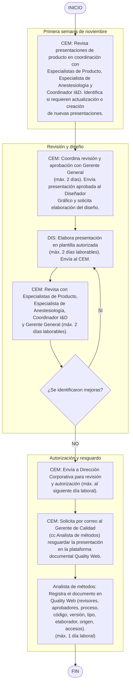

# Preparación y Autorización de Material de Talleres Médicos

> Fuente: `pdf/Educacion_medica/Preparación y autorización de material de talleres médicos.pdf`
> Código: [[Preparación y Autorización de Material de Talleres Médicos|ASK-CEM-IDT-001]] · Versión: 02 · Fecha: 03-feb-2024
> Proceso: Educación Médica · Área: Coordinación de Educación Médica

Instructivo de trabajo para la elaboración y aprobación del material didáctico utilizado en los [[Talleres Médicos en Hospitales]].

## 1. Bitácora control de cambios

| N° | Fecha | Versión | Descripción del cambio | Justificación | Realizado por | Aprobado por |
|----|-------|---------|------------------------|---------------|---------------|--------------|
| 1 | 08-feb-2022 | 01 | Documento de nueva creación. | Debido a mejoras detectadas en los procesos y la actualización en la norma ISO 9001:2015. | Ing. Omar Castro · Ing. Gerardo Muñoz | Lic. Héctor de Jesús Vélez Rivera |
| 2 | 02-feb-2024 | 02 | 3 Se cambia el alcance de la instrucción. 5.1 Se agrega el periodo de tiempo en el cual se van a revisar las presentaciones; se cambia el punto 1 del contenido de las presentaciones a "Lefarma y Asokam líderes en México en dispositivos para anestesia". 5.2, 5.3, 5.4, 5.5, 5.6 se cambia la redacción de estos puntos. 5.7 se agrega la descripción de actividades para el resguardo de la presentación en la plataforma Quality Web. | Se agrega el puesto de Coordinador de Educación Médica. | Ing. Javier Páez Aldaco | Lic. Héctor Vélez Rivera |

## 2. Objetivo

Establecer las actividades para la elaboración y aprobación de todo el material didáctico que se utilizará en los talleres médicos con la finalidad de promocionar y difundir los productos médicos distribuidos por Asokam.

## 3. Alcance

Esta instrucción de trabajo aplica desde que el [[Roles y Abreviaturas|Coordinador de Educación Médica]] inicia la elaboración y revisión del material que se utiliza en las presentaciones de los talleres médicos para promocionar los productos fabricados por Lefarma hasta el resguardo de la presentación autorizada en la plataforma documental Quality Web.

## 4. Abreviaturas y definiciones

- **4.1. Material didáctico:** Recursos y herramientas ya sea físico y/o electrónico que se implementa para asistir y hacer más efectivo el proceso de enseñanza.
- **4.2. Slide:** Es una diapositiva en Power Point.
- **4.3. Taller médico:** Actividad de presentar, demostrar y utilizar un dispositivo médico fabricado por Asokam al personal médico en los quirófanos de las Unidades Médicas Hospitalarias.

## 5. Flujo del proceso para la preparación y autorización del material de talleres médicos

| No. | Acción | Responsable | Documento relacionado |
|-----|--------|-------------|----------------------|
| **5.1** | Revisa en la primera semana del mes de noviembre las presentaciones que los [[Roles y Abreviaturas\|especialistas de producto]] utilizarán en los talleres médicos para promocionar los productos Lefarma, que serán considerados en el plan anual de educación médica del próximo año, en coordinación con: (1) [[Roles y Abreviaturas\|Especialistas de Producto]], (2) Especialista de Anestesiología, (3) [[Roles y Abreviaturas\|Coordinador de Investigación y Desarrollo de Dispositivos Médicos]]. Para identificar si requieren actualizarlas o bien crear otras. Todas las presentaciones deberán contar con los siguientes temas: 1. Lefarma y Asokam líderes en México en dispositivos para anestesia. 2. Producto a presentar: Nombre y contenido del producto. 3. Propuestas de valor del producto y normas de calidad que cumple el producto. 4. Cuáles son los beneficios que se obtendrán al utilizar el producto (4.1 Beneficios para el anestesiólogo / 4.2 Beneficios para la institución / 4.3 Beneficios para el paciente). 5. Evolución y mejora continua del producto basada en la retroalimentación de los médicos. 6. Atención de quejas. 7. Datos de contacto de Asokam. | [[Roles y Abreviaturas\|Coordinación de Educación Médica]] | Presentación en Power Point del producto |
| **5.2** | Coordina con el [[Roles y Abreviaturas\|Gerente General]] la revisión y aprobación de la presentación en un periodo de tiempo máximo de 2 días. Envía por correo electrónico al [[Roles y Abreviaturas\|diseñador gráfico]] el documento aprobado el mismo día de su autorización, y solicita la elaboración del diseño. | [[Roles y Abreviaturas\|Coordinación de Educación Médica]] | Presentación en Power Point del producto |
| **5.3** | Recibe el correo electrónico y en un periodo máximo de 2 días laborables, elabora la presentación en la plantilla autorizada, anexando imágenes que permitan resaltar el contenido. Una vez terminado envía la presentación al [[Roles y Abreviaturas\|Coordinador de Educación Médica]]. | [[Roles y Abreviaturas\|Diseñador Gráfico]] | Correo electrónico · ASK-CBA-FOR-001 Plantilla de presentación Asokam |
| **5.4** | Recibe la presentación y en conjunto con los siguientes puestos, la revisan en un periodo máximo de 2 días laborables: (1) [[Roles y Abreviaturas\|Especialistas de Producto]], (2) Especialista de Anestesiología, (3) [[Roles y Abreviaturas\|Coordinador de Investigación y Desarrollo de Dispositivos Médicos]], (4) [[Roles y Abreviaturas\|Gerente General]]. En caso de identificar mejoras, solicita inmediatamente por correo electrónico al [[Roles y Abreviaturas\|diseñador gráfico]] realizar mejoras a la presentación. | [[Roles y Abreviaturas\|Coordinación de Educación Médica]] | Correo electrónico · Presentación en Power Point del producto |
| **5.5** | Envía máximo al otro día laboral a [[Roles y Abreviaturas\|Dirección Corporativa]] para su revisión y obtiene su autorización. | [[Roles y Abreviaturas\|Coordinación de Educación Médica]] | — |
| **5.6** | Solicita por correo electrónico al [[Roles y Abreviaturas\|Gerente de Calidad]] con copia al [[Roles y Abreviaturas\|Analista de Métodos y Procedimientos]] que resguarde la presentación en la plataforma documental y anexa la presentación. | [[Roles y Abreviaturas\|Coordinación de Educación Médica]] | Correo electrónico · Presentación en Power Point del producto |
| **5.7** | Recibe el correo y realiza las siguientes actividades en un periodo máximo de 1 día laboral: 1. Ingresa a la plataforma Quality Web y elige la opción de "configuración del sistema". 2. Selecciona la opción de "catálogo de documentos" y da clic en "Nuevo". 3. Registra la siguiente información: 3.1 Revisores · 3.2 Aprobadores · 3.3 Proceso al que pertenece el documento · 3.4 Código del documento · 3.5 Nombre · 3.6 Versión del documento · 3.7 Tipo de documento · 3.8 Elaborador · 3.9 Origen: interno o externo. 4. En la opción "archivo" arrastra el archivo o da clic para cargar el documento. 5. Asigna las restricciones del documento (lectura e impresión) y si desea que esté disponible para que los usuarios puedan descargarlo en su formato original. 6. Selecciona a los usuarios que tendrán acceso al documento. 7. Da clic en "Guardar". **Termina Instrucción.** | [[Roles y Abreviaturas\|Analista de métodos]] | Presentación en Power Point del producto · Plataforma documental Quality Web |

## 6. Anexos

| N° | Código | Nombre | Responsable | Disposición final |
|----|--------|--------|-------------|-------------------|
| 1 | [[ASK-CBA-FOR-001 Plantilla de Presentación Asokam\|ASK-CBA-FOR-001]] | Plantilla de presentación Asokam | [[Roles y Abreviaturas\|Coordinador de Educación Médica]] | Físico y Electrónico |

## Diagrama de flujo

## Firmas

| Puesto | Nombre | Rol | Fecha |
|--------|--------|-----|-------|
| Analista de métodos y procedimientos | Ing. Javier Paez Aldaco | Elaboró | 03-feb-2024 |
| Gerente de calidad | QFB. Daniel Gasca Hinojosa | Revisó | 03-feb-2024 |
| Gerente General | Lic. Luis Antonio Pozo Urquizo | Revisó | 08-feb-2024 |
| Director corporativo | Lic. Héctor Vélez Rivera | Autorizó | 08-feb-2024 |

## Véase también

- [[Talleres Médicos en Hospitales]]
- [[Educación Médica]]
- [[Formularios]]
- [[Roles y Abreviaturas]]
