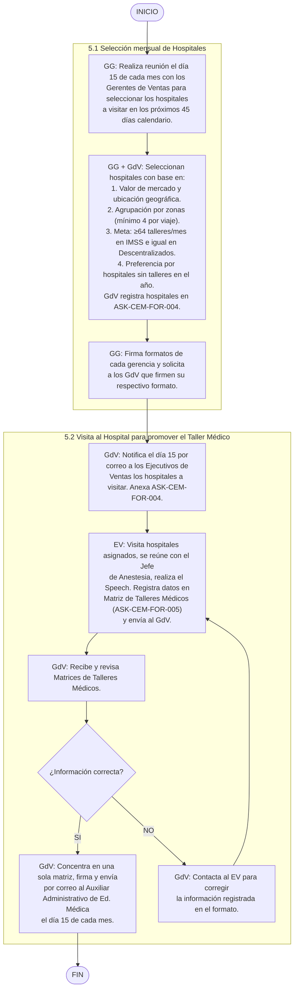

# Selección Mensual de Hospitales para Talleres Médicos

> Fuente: `pdf/Educacion_medica/Selección mensual de hospitales para talleres médicos.pdf`
> Código: [[Selección Mensual de Hospitales para Talleres Médicos|ASK-CEM-IDT-003]] · Versión: 02 · Fecha: 24-abr-2024
> Proceso: Educación Médica · Área: Gerencia de Ventas / Educación Médica

Instrucción de trabajo para seleccionar mensualmente los hospitales que serán visitados en los próximos 45 días calendario por los [[Roles y Abreviaturas|Ejecutivos de Ventas]] para realizar [[Talleres Médicos en Hospitales]].

## 1. Bitácora control de cambios

| N° | Fecha | Versión | Descripción del cambio | Justificación | Realizado por | Aprobado por |
|----|-------|---------|------------------------|---------------|---------------|--------------|
| 1 | 08-feb-2022 | 0.1 | Documento de nueva creación. | Debido a mejoras detectadas en los procesos y la actualización en la norma ISO 9001:2015. | Ing. Omar Castro · Ing. Gerardo Muñoz | Lic. Héctor de Jesús Vélez Rivera, Director Corporativo. |
| 2 | 19-abr-2024 | 02 | Se cambia el nombre de la instrucción a "Selección de Hospitales para talleres Médicos". 5.1 Este punto cambia de nombre a Selección mensual de Hospitales. 5.2 se elimina la Planeación de Talleres de la instrucción de trabajo y se agrega "Visita al Hospital para Promover el Taller Médico". | Seleccionar mensualmente el hospital y realizar una adecuada planificación del taller médico. | Ing. Javier Páez Aldaco | Lic. Héctor Vélez Rivera |

## 2. Objetivo

Establecer las actividades necesarias para seleccionar mensualmente los hospitales que serán visitados en los próximos 45 días calendario, por los ejecutivos de ventas para realizar talleres médicos.

## 3. Alcance

Esta instrucción de trabajo inicia cuando el [[Roles y Abreviaturas|Gerente General]] realiza reunión con los [[Roles y Abreviaturas|Gerentes de Ventas]] para seleccionar los hospitales que se visitarán el siguiente mes y termina cuando el [[Roles y Abreviaturas|Ejecutivo de Ventas]] envía el formato [[ASK-CEM-FOR-005 Matriz de Talleres Médicos|Matriz de Talleres Médicos]] al [[Roles y Abreviaturas|Gerente de Ventas]].

## 4. Abreviaturas y definiciones

- **4.1. Material didáctico:** Recursos y herramientas ya sea físico y/o electrónico que se implementa para asistir y hacer más efectivo el proceso de enseñanza.
- **4.2. Taller médico:** Actividad de presentar, demostrar y utilizar un dispositivo Médico fabricado por Asokam al personal médico en los Quirófanos de las Unidades Médicas Hospitalarias.
- **4.3. Viáticos:** Son los recursos monetarios asignados a los trabajadores para el desempeño de sus actividades, cuando deban trasladarse a un lugar distinto al de su adscripción; dichos recursos cubren gastos de transporte, hospedaje, alimentación y alquiler de autos.

## 5. Flujo del proceso para la selección mensual de hospitales

### 5.1. Selección mensual de Hospitales

| No. | Acción | Responsable | Documento relacionado |
|-----|--------|-------------|----------------------|
| **5.1.1** | Realiza reunión los días 15 de cada mes, con los [[Roles y Abreviaturas\|Gerentes de Ventas]] para seleccionar los hospitales que se visitarán en los próximos 45 días calendario. _Nota: en caso de que el día 15 no se labore, la reunión se llevará a cabo el siguiente día laboral._ | [[Roles y Abreviaturas\|Gerente General]] | — |
| **5.1.2** | En base a los Hospitales y al número de talleres registrados en los formatos "[[ASK-CEM-FOR-002 Base de Datos de Hospitales\|Base de datos de Hospitales para talleres médicos]]" y "[[ASK-CEM-FOR-003 Programa Anual de Talleres Médicos\|Programa anual de talleres médicos]]", realizan la selección de hospitales de la siguiente manera: 1. Priorizan hospitales en función de su valor de mercado y su ubicación geográfica. 2. Agrupa hospitales por zonas geográficas para que, en un mismo viaje foráneo, el ejecutivo de ventas visite varios hospitales y programe mínimo 4 hospitales para taller médico. 3. Se deben programar al menos 64 talleres en el mes en IMSS y la misma cantidad en Descentralizados. 2.1 La cuota de talleres por especialista de producto es de al menos 4 hospitales y 6 talleres por semana. 2.2 En el mes se pueden programar hasta 3 viajes foráneos por especialista por mes. 2.3 En caso que la operación lo demande, se pueden hacer más viajes foráneos en el mes. Esto se documentará, para tomarlo en cuenta y acordar con especialista de producto la mejor manera de ajustar la agenda. 3. Seleccionan de manera preferente, hospitales en los cuales aún no se han hecho talleres en el año. En los que ya se han realizado, se priorizará aquellos en los que ha pasado más tiempo desde el último taller. | [[Roles y Abreviaturas\|Gerente General]] / [[Roles y Abreviaturas\|Gerentes de Ventas]] | [[ASK-CEM-FOR-002 Base de Datos de Hospitales]] · [[ASK-CEM-FOR-003 Programa Anual de Talleres Médicos]] |
| **5.1.3** | Al final de la reunión firma los formatos de cada gerencia y solicita a los [[Roles y Abreviaturas\|Gerentes de ventas]] que firmen su respectivo formato. | [[Roles y Abreviaturas\|Gerente General]] | ASK-CEM-FOR-004 Selección de hospitales para talleres médicos |

### 5.2. Visita al Hospital para promover el Taller Médico

| No. | Acción | Responsable | Documento relacionado |
|-----|--------|-------------|----------------------|
| **5.2.1** | Notifica por correo electrónico los días 15 de cada mes a los [[Roles y Abreviaturas\|ejecutivos de Ventas]] a su cargo, los hospitales que deberán visitar. Anexa el formato "ASK-CEM-FOR-004 Selección de Hospitales para Talleres Médicos". | [[Roles y Abreviaturas\|Gerente de Ventas]] | ASK-CEM-FOR-004 Selección de Hospitales para talleres Médicos |
| **5.2.2** | Recibe el correo electrónico y revisa el formato Selección de Hospitales. Realiza la visita a los hospitales que le asignaron, se reúne con el Jefe de servicio de Anestesia y realiza el Speech para promover el Taller Médico. Al final registra la siguiente información en el formato [[ASK-CEM-FOR-005 Matriz de Talleres Médicos\|Matriz de Talleres Médicos]]: 1. Gerencia: IMSS o Descentralizados · 2. Región · 3. Hospital · 4. Estado · 5. Ciudad/Municipio · 6. No. de participantes · 7. Nombre del ejecutivo · 8. Fecha de taller · 9. Hora del taller médico · 10. ¿Requiere equipo de proyección? · 11. Nombre del Producto · 12. Cantidad (piezas) de producto. Envía por correo electrónico al [[Roles y Abreviaturas\|Gerente de Ventas]] el formato Matriz de Talleres Médicos. | [[Roles y Abreviaturas\|Ejecutivo de Ventas]] | ASK-CEM-ANE-001 Speech para promover el Taller Médico · [[ASK-CEM-FOR-005 Matriz de Talleres Médicos]] |
| **5.2.3** | Recibe por correo electrónico los formatos "[[ASK-CEM-FOR-005 Matriz de Talleres Médicos\|Matriz de Talleres Médicos]]" y los revisa. Si todo está bien los concentra en una sola matriz, firma el formato y lo envía por correo electrónico el día 15 de cada mes al [[Roles y Abreviaturas\|Auxiliar Administrativo de Educación Médica]]. De lo contrario contacta al [[Roles y Abreviaturas\|Ejecutivo de Ventas]] para corregir la información registrada en el formato. **Termina instrucción.** | [[Roles y Abreviaturas\|Gerente de Ventas]] | [[ASK-CEM-FOR-005 Matriz de Talleres Médicos]] |

## 6. Anexos

| N° | Código | Nombre | Responsable | Disposición final |
|----|--------|--------|-------------|-------------------|
| 1 | [[ASK-CEM-FOR-004 Selección de Hospitales para Talleres Médicos\|ASK-CEM-FOR-004]] | Selección de Hospitales para talleres Médicos | [[Roles y Abreviaturas\|Gerente de Ventas]] | Electrónico |

### Anexo 1. Selección de Hospitales para Talleres Médicos

**Gerencia de ventas:** _______________ · **Fecha:** _______________

| No. | Región | Hospital | Estado | Ciudad / Municipio | Ejecutivo | Producto a promocionar | Observaciones |
|-----|--------|----------|--------|--------------------|-----------|------------------------|---------------|
| 1  | | | | | | | |
| 2  | | | | | | | |
| 3  | | | | | | | |
| 4  | | | | | | | |
| 5  | | | | | | | |
| 6  | | | | | | | |
| 7  | | | | | | | |
| 8  | | | | | | | |
| 9  | | | | | | | |
| 10 | | | | | | | |
| 11 | | | | | | | |
| 12 | | | | | | | |
| 13 | | | | | | | |
| 14 | | | | | | | |
| 15 | | | | | | | |
| 16 | | | | | | | |
| 17 | | | | | | | |
| 18 | | | | | | | |
| 19 | | | | | | | |

| | Nombre | Puesto | Firma | Fecha |
|--|--------|--------|-------|-------|
| **Elaboró** | | | | |
| **Revisó** | | | | |
| **Autorizó** | | | | |

## Diagrama de flujo

## Firmas

| Puesto | Nombre | Rol | Fecha |
|--------|--------|-----|-------|
| Analista de métodos y procedimientos | Ing. Javier Paez Aldaco | Elaboró | 24-abr-2024 |
| Gerente de calidad | QFB. Daniel Gasca Hinojosa | Revisó | 24-abr-2024 |
| Gerente General | Lic. Luis Antonio Pozo Urquizo | Revisó | 26-abr-2024 |
| Director corporativo | Lic. Héctor Vélez Rivera | Autorizó | 28-abr-2024 |

## Véase también

- [[Talleres Médicos en Hospitales]]
- [[Elaboración del Concentrado Anual de Talleres Médicos]]
- [[Solicitud y Entrega de Materiales para Talleres Médicos]]
- [[ASK-CEM-FOR-005 Matriz de Talleres Médicos]]
- [[Formularios]]
- [[Roles y Abreviaturas]]
