# Solicitud y Entrega de Materiales para Talleres Médicos

> Fuente: `pdf/Educacion_medica/Solicitud y entrega de materiales para Talleres Médicos.pdf`
> Código: [[Solicitud y Entrega de Materiales para Talleres Médicos|ASK-CEM-IDT-004]] · Versión: 01 · Fecha: 24-abr-2024
> Proceso: Educación Médica · Área: Auxiliar Administrativo de Educación Médica / Administración

Instrucción de trabajo para la solicitud y entrega de material que requieren los [[Roles y Abreviaturas|Especialistas de Producto]] para llevar a cabo el [[Talleres Médicos en Hospitales|Taller Médico]].

## 1. Bitácora control de cambios

| N° | Fecha | Versión | Descripción del cambio | Justificación | Realizado por | Aprobado por |
|----|-------|---------|------------------------|---------------|---------------|--------------|
| 1 | 23-abr-2024 | 01 | Documento nuevo. | Tener el material necesario para realizar el taller médico. | Ing. Javier Páez Aldaco | Lic. Héctor Vélez Rivera |

## 2. Objetivo

Establecer las actividades necesarias para la solicitud y entrega de material que requieren los [[Roles y Abreviaturas|Especialistas de productos]] para llevar a cabo el taller Médico.

## 3. Alcance

Esta instrucción de trabajo inicia cuando el [[Roles y Abreviaturas|Auxiliar Administrativo de Educación Médica]] recibe la [[ASK-CEM-FOR-005 Matriz de Talleres Médicos|Matriz de Talleres Médicos]] hasta que el [[Roles y Abreviaturas|Ejecutivo de Ventas]] recibe el material para la realización de los talleres médicos.

## 4. Abreviaturas y definiciones

- **4.1. Carta Porte:** Es un documento internacional de carácter jurídico, mediante el cual la empresa transportista formaliza los términos para el traslado de mercancías.
- **4.2. Entrega Ocurre:** Modalidad de entrega donde el destinatario con identificación oficial, acude directamente a alguna de las sucursales del proveedor de paquetería a recoger el paquete.
- **4.3. Taller médico:** Actividad de presentar, demostrar y utilizar un dispositivo Médico fabricado por Asokam al personal médico en los Quirófanos de las Unidades Médicas Hospitalarias.

## 5. Flujo del proceso para la Solicitud y entrega de material para Talleres Médicos

| No. | Acción | Responsable | Documento relacionado |
|-----|--------|-------------|----------------------|
| **5.1** | Recibe el día 15 de cada mes, por correo electrónico la [[ASK-CEM-FOR-005 Matriz de Talleres Médicos\|Matriz de Talleres Médicos]] firmada por los [[Roles y Abreviaturas\|Gerentes de Ventas]] y realiza las siguientes actividades: 1. Registra en la Matriz de Talleres Médicos los costos totales de: 1.1 Muestras de Producto · 1.2 Folletos · 1.3 Gastos de envío · 1.4 Box lunch. 2. Envía por correo electrónico la Matriz de Talleres al [[Roles y Abreviaturas\|Coordinador Administrativo]] para su revisión. 3. Realiza calendario de Talleres Médicos los días 17 de cada mes y lo envía por correo electrónico a los [[Roles y Abreviaturas\|Gerentes de ventas]], [[Roles y Abreviaturas\|Especialistas de producto]] y al [[Roles y Abreviaturas\|Gerente General]]. | [[Roles y Abreviaturas\|Auxiliar Administrativo de Educación Médica]] | [[ASK-CEM-FOR-005 Matriz de Talleres Médicos]] · [[ASK-CEM-FOR-006 Calendario de Talleres Médicos]] |
| **5.2** | Recibe la matriz y revisa que todos los costos estén de acuerdo a las políticas establecidas. Si todo está bien firma la Matriz y la envía inmediatamente por correo electrónico a [[Roles y Abreviaturas\|Dirección Corporativa]] para su autorización. Envía por correo electrónico a más tardar el día 20 de cada mes, la Matriz autorizada al [[Roles y Abreviaturas\|Auxiliar Administrativo de Educación Médica]]. | [[Roles y Abreviaturas\|Coordinador Administrativo]] | [[ASK-CEM-FOR-005 Matriz de Talleres Médicos]] |
| **5.3** | Una vez autorizada la Matriz realiza las siguientes actividades: 1. Envía por correo al [[Roles y Abreviaturas\|Tesorero]] la Matriz para que programe el pago del box lunch. 2. Solicita por correo al [[Roles y Abreviaturas\|Coordinador Administrativo]] el material para Taller Médico. Anexa la Matriz. 3. Actualiza el calendario de los talleres médicos y lo envía por correo al [[Roles y Abreviaturas\|Especialista de Producto]] y al [[Roles y Abreviaturas\|Coordinador Administrativo]]. 4. Solicita los viáticos de acuerdo a lo establecido en la instrucción de trabajo [[ASK-GGE-IDT-001 Solicitud y aprobación de viáticos\|ASK-GGE-IDT-001]] "Solicitud y aprobación de viáticos". | [[Roles y Abreviaturas\|Auxiliar Administrativo de Educación Médica]] | [[ASK-CEM-FOR-005 Matriz de Talleres Médicos]] · [[ASK-CEM-FOR-006 Calendario de Talleres Médicos]] · ASK-GGE-IDT-001 Solicitud y aprobación de viáticos |
| **5.4** | Recibe los formatos "[[ASK-CEM-FOR-005 Matriz de Talleres Médicos\|Matriz de Talleres Médicos]]" y solicita el material para Talleres Médicos: 1. Genera el formato "Pedido interno" con la información registrada en la Matriz de Talleres Médicos. 2. Firma el formato. 3. Envía el formato por correo electrónico al [[Roles y Abreviaturas\|Auxiliar Administrativo de Almacén]]. Anexa la Matriz firmada por Dirección. 4. Da seguimiento a la entrega del material al [[Roles y Abreviaturas\|Auxiliar Administrativo de Educación Médica]]. | [[Roles y Abreviaturas\|Coordinador Administrativo]] | [[ASK-CEM-FOR-005 Matriz de Talleres Médicos]] |
| **5.5** | Recibe por correo electrónico la "Matriz de talleres" autorizada y realiza las siguientes actividades: 1. Programa semanalmente los pagos de box lunch y registra la siguiente información en el formato "Deposito box lunch para Talleres Médicos IMSS y Descentralizados": 1.1 Periodo que comprende la semana · 1.2 Depositar a: puede ser al Proveedor de box lunch o al [[Roles y Abreviaturas\|Ejecutivo de Ventas]] · 1.3 Monto a depositar · 1.4 Fecha de depósito · 1.5 Ejecutivo: nombre del [[Roles y Abreviaturas\|Ejecutivo de Ventas]] que va a realizar la comprobación del box lunch. 2. Envía por correo electrónico el formato al [[Roles y Abreviaturas\|Tesorero Corporativo]]. 3. Presenta los días martes de cada semana a [[Roles y Abreviaturas\|Dirección]] el importe de box lunch para su autorización. 4. Envía por correo electrónico el día martes, después de la reunión con [[Roles y Abreviaturas\|Dirección]], el formato autorizado al [[Roles y Abreviaturas\|Tesorero Corporativo]]. Copia en el correo al [[Roles y Abreviaturas\|Gerente de administración y finanzas]] y al [[Roles y Abreviaturas\|Auditor Corporativo]]. | [[Roles y Abreviaturas\|Auxiliar de Pagos]] | [[ASK-CEM-FOR-005 Matriz de Talleres Médicos]] · ASK-TES-FOR-001 Deposito box lunch para Talleres Médicos IMSS y Descentralizados |
| **5.6** | Recibe por correo electrónico los formatos, verifica que la información esté correcta y si todo está correcto realiza los depósitos correspondientes. Envía por correo electrónico los comprobantes de los depósitos al [[Roles y Abreviaturas\|Auxiliar de Pagos]]. | [[Roles y Abreviaturas\|Tesorero Corporativo]] | ASK-TES-FOR-001 Deposito box lunch para Talleres Médicos IMSS y Descentralizados |
| **5.7** | Recibe por correo electrónico el comprobante de depósito. Envía por correo electrónico el comprobante de depósito al [[Roles y Abreviaturas\|Auxiliar Administrativo de Educación Médica]]. | [[Roles y Abreviaturas\|Auxiliar de Pagos]] | Comprobante de depósito |
| **5.8** | Recibe el material para talleres Médicos y si todo está correcto firma de recibido en la Orden de Remisión. Forma paquetes conformados de la siguiente manera: 1. Producto · 2. Folletos · 3. Registro de asistencia · 4. Dulces · 5. Computadora y/o proyector en caso de aplicar. Coordina la entrega de material de la siguiente manera: 1. CDMX y área metropolitana: informa a los [[Roles y Abreviaturas\|Ejecutivos de Ventas]] y a los [[Roles y Abreviaturas\|Gerentes de Ventas]] para la entrega del material del taller Médico en un horario de 4:30 a 6:30 de la tarde. 2. Foránea: 2.1 Se presenta en la sucursal del proveedor de paquetería, anota las direcciones y el nombre de los ejecutivos de Ventas y envía los paquetes 7 días calendario antes del Taller Médico. 2.2 Envía 7 días calendario antes del Taller por correo electrónico al [[Roles y Abreviaturas\|Ejecutivo de Ventas]]: (1) Carta porte, (2) Número de piezas que van por paquete, (3) Fecha de cuando puede recoger los paquetes. _Nota: Para la opción foránea, si el número de equipos es de 5 o menos, se los puede llevar el [[Roles y Abreviaturas\|Especialista de producto]]; de lo contrario se requerirán los servicios del proveedor de paquetería._ | [[Roles y Abreviaturas\|Auxiliar Administrativo de Educación Médica]] | Orden de Remisión |
| **5.9** | Recibe el material y revisa: 1. Cantidad y condiciones de los productos. 2. En caso de aplicar, funcionamiento adecuado del equipo de cómputo y audiovisual. Si todo está bien, firma de recibido en formato [[ASK-CEM-FOR-007 Material para Talleres Médicos\|ASK-CEM-FOR-007]] "Material para talleres médicos" y lo entrega al [[Roles y Abreviaturas\|Auxiliar Administrativo de Educación Médica]]. En el caso de ser foráneo, envía una copia del formato firmado vía correo electrónico el mismo día que recibe el material. _Nota: En caso de talleres foráneos, si el [[Roles y Abreviaturas\|Ejecutivo]] indica que no recibió la totalidad de los recursos y materiales, el [[Roles y Abreviaturas\|Auxiliar Administrativo de Educación Médica]] en conjunto con el [[Roles y Abreviaturas\|Coordinador Administrativo]] realizan las acciones pertinentes para que el material esté completo un día antes del taller._ **Termina Instrucción.** | [[Roles y Abreviaturas\|Ejecutivo de Ventas]] | ASK-CEM-FOR-007 Material para talleres médicos |

## 6. Anexos

| N° | Código | Nombre | Responsable | Disposición final |
|----|--------|--------|-------------|-------------------|
| 1 | [[ASK-CEM-FOR-006 Calendario de Talleres Médicos\|ASK-CEM-FOR-006]] | Calendario de Talleres Médicos | [[Roles y Abreviaturas\|Administrativo de Educación Médica]] | Físico y Electrónico |
| 2 | [[ASK-CEM-FOR-007 Material para Talleres Médicos\|ASK-CEM-FOR-007]] | Material para talleres médicos | [[Roles y Abreviaturas\|Administrativo de Educación Médica]] | Físico y Electrónico |

### Anexo 1. Material para Talleres Médicos

| No | Fecha | Hospital | Cargo / Puesto | Nombre del Producto | Cantidad de Producto | Lista de asistencia (SI/NO) | Flayers | Equipo de cómputo (SI/NO) | Proyector (SI/NO) | Dulces (SI/NO) | Modelo anatómico (SI/NO) | Observaciones |
|----|-------|----------|----------------|----------------------|----------------------|------------------------------|---------|---------------------------|-------------------|----------------|--------------------------|---------------|
| 1 | | | | | | | | | | | | |
| 2 | | | | | | | | | | | | |
| 3 | | | | | | | | | | | | |
| 4 | | | | | | | | | | | | |
| 5 | | | | | | | | | | | | |
| 6 | | | | | | | | | | | | |
| 7 | | | | | | | | | | | | |
| 8 | | | | | | | | | | | | |

**Nombre y Firma del Ejecutivo que recibe:** _____________________________________________________________

## Diagrama de flujo

```mermaid
flowchart TD
    INICIO([INICIO])

    P51["AEM: Día 15 recibe Matriz de Talleres firmada por GdV.\n1. Registra costos: Muestras, Folletos, Envío, Box lunch.\n2. Envía Matriz al CA para revisión.\n3. Realiza Calendario de Talleres el día 17 y lo envía\na GdV, Especialistas de Producto y GG."]

    P52["CA: Revisa costos conforme a políticas establecidas."]
    OK1{¿Costos correctos?}
    P52b["CA: Firma Matriz y envía a DC para autorización.\nEnvía Matriz autorizada al AEM a más tardar el día 20."]

    P53["AEM: Envía Matriz al Tesorero para pago de box lunch.\nSolicita material al CA. Actualiza calendario.\nSolicita viáticos (ASK-GGE-IDT-001)."]

    P54["CA: Genera Pedido Interno con datos de la Matriz.\nFirma y envía al Aux. Admin. Almacén.\nDa seguimiento a entrega de material al AEM."]

    P55["Aux. Pagos: Programa pagos semanales de box lunch.\nRegistra en ASK-TES-FOR-001. Envía al TC.\nPresenta importe los martes a Dirección para autorización.\nEnvía formato autorizado al TC (cc Gte. Admin. y Auditor)."]

    P56["TC: Verifica información y realiza depósitos.\nEnvía comprobantes al Aux. de Pagos."]

    P57["Aux. Pagos: Recibe comprobante y reenvía al AEM."]

    P58["AEM: Recibe material, firma Orden de Remisión.\nForma paquetes (producto, folletos, registro,\ndulces, equipo). Coordina entrega:\nCDMX: horario 4:30–6:30 p.m.\nForánea: paquetería 7 días antes + carta porte al EV."]

    P59["EV: Recibe material, verifica cantidad, condiciones\ny funcionamiento de equipo. Firma ASK-CEM-FOR-007.\nForáneo: envía copia firmada por correo el mismo día."]

    OK2{¿Material completo?}
    P59b["AEM + CA: Gestionan acciones pertinentes para que\nel material esté completo un día antes del taller."]

    FIN([FIN])

    INICIO --> P51 --> P52 --> OK1
    OK1 -- SI --> P52b --> P53
    OK1 -- NO --> P52
    P53 --> P54 & P55
    P55 --> P56 --> P57 --> P58
    P54 --> P58
    P58 --> P59 --> OK2
    OK2 -- SI --> FIN
    OK2 -- NO --> P59b --> FIN
```

## Firmas

| Puesto | Nombre | Rol | Fecha |
|--------|--------|-----|-------|
| Analista de métodos y procedimientos | Ing. Javier Paez Aldaco | Elaboró | 24-abr-2024 |
| Gerente de calidad | QFB. Daniel Gasca Hinojosa | Revisó | 24-abr-2024 |
| Gerente General | Lic. Luis Antonio Pozo Urquizo | Revisó | 26-abr-2024 |
| Director corporativo | Lic. Héctor Vélez Rivera | Autorizó | 28-abr-2024 |

## Véase también

- [[Talleres Médicos en Hospitales]]
- [[Selección Mensual de Hospitales para Talleres Médicos]]
- [[Impartición de Talleres Médicos]]
- [[ASK-CEM-FOR-005 Matriz de Talleres Médicos]]
- [[ASK-CEM-FOR-006 Calendario de Talleres Médicos]]
- [[Formularios]]
- [[Roles y Abreviaturas]]
