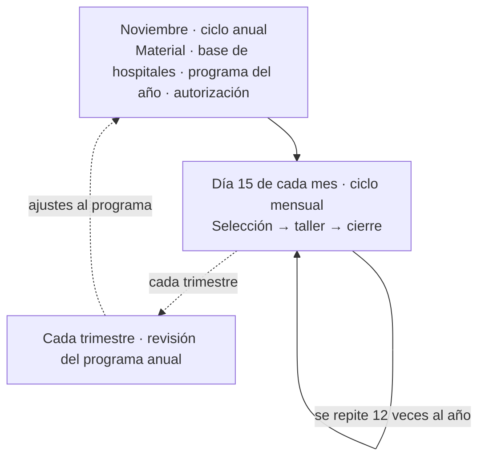
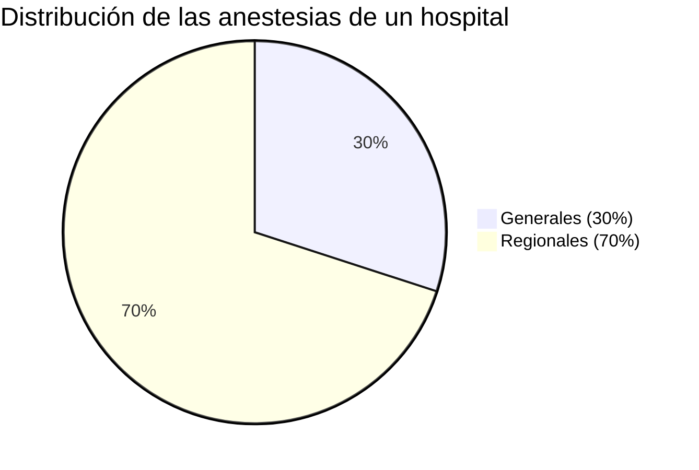
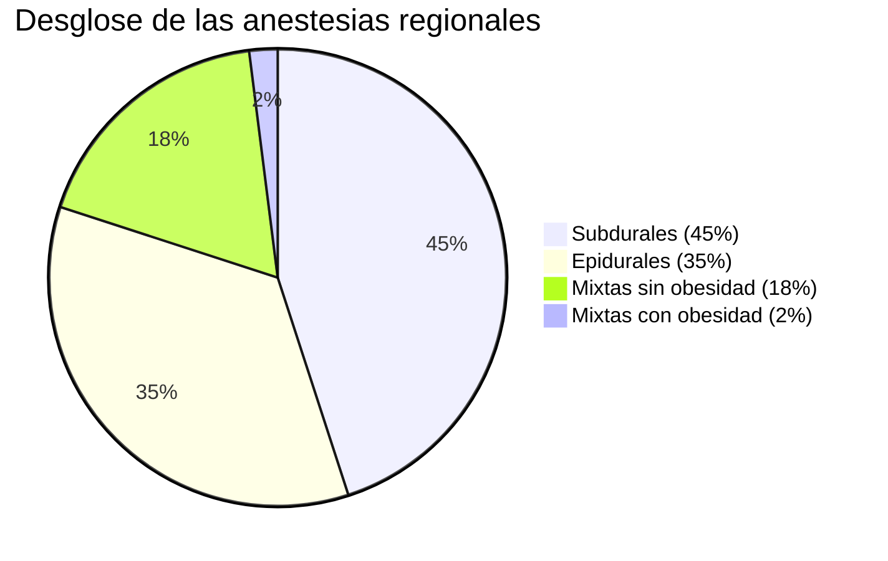
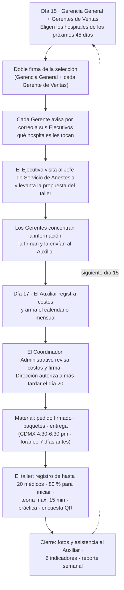
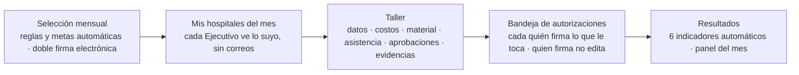

# Talleres Médicos en Hospitales
## Cómo funciona hoy y cómo lo vamos a digitalizar

Este documento presenta la operación actual del proceso de talleres médicos en hospitales y la propuesta para digitalizarla en un sistema de pantallas. Al cierre se detallan los puntos pendientes de decisión.

---

## 1. Quiénes participan

| Participante | Qué hace en el proceso |
|---|---|
| **Coordinador de Educación Médica** | Encabeza la planeación anual, coordina la preparación del material de capacitación y presenta cada semana los resultados a la Gerencia General y a la Dirección Corporativa. |
| **Gerencia General** | Aprueba el programa anual y firma la selección mensual de hospitales. |
| **Gerentes de Ventas** | Concentran la información de sus vendedores, la firman y les avisan qué hospitales visitar. |
| **Ejecutivos de Ventas** | Visitan los hospitales, proponen cada taller, reciben el material y acompañan la impartición. |
| **Especialistas de Producto** | Son los educadores: imparten el taller y registran a los asistentes. |
| **Auxiliar Administrativo de Educación Médica** | Registra los costos, arma el calendario mensual, gestiona el material y consolida los resultados. |
| **Coordinador Administrativo** | Revisa que los costos cumplan las políticas y genera el pedido del material. |
| **Dirección Corporativa** | Da la autorización final del material, del programa anual y de cada taller del mes. |
| **Ejecutivo de Estadística** | Arma cada año la base de hospitales. |
| **Diseñador** | Diseña la presentación de producto con la plantilla autorizada. |
| **Investigación y Desarrollo** | Participa en la revisión técnica del material. |

> Control de Quejas y Tecnovigilancia **no participan** en el día a día; solo consultan información al cierre (evidencias y asistencias).

## 2. El proceso tiene dos ritmos

| Ritmo | Cuándo | Qué se define |
|---|---|---|
| **Anual** | Noviembre | El material de capacitación, la base de hospitales y el programa del año (cuántos talleres daremos). Se revisa **cada trimestre**. |
| **Mensual** | El día 15 de cada mes | Qué hospitales se visitan. Este ciclo corre **12 veces al año**. |



## 3. El ciclo anual — noviembre

### 3.1 Preparar el material de capacitación

1. El **Coordinador de Educación Médica** revisa las presentaciones de producto junto con los **Especialistas de Producto**, el médico **Especialista en Anestesiología** e **Investigación y Desarrollo**. Cada presentación debe cubrir 7 temas obligatorios (entre ellos, la atención de quejas).
2. La **Gerencia General aprueba el contenido** y el **Diseñador** lo maqueta con la plantilla autorizada.
3. Se hace una **revisión conjunta** (coordinador, especialistas, investigación y desarrollo y Gerencia General) y se ajusta lo necesario.
4. La **Dirección Corporativa autoriza** la presentación final.
5. El material autorizado se **resguarda en la plataforma documental de la empresa**, donde queda disponible para todo el año.

### 3.2 La base de hospitales

- El Coordinador de Educación Médica pide, la **primera semana de noviembre**, la base de hospitales actualizada al **Ejecutivo de Estadística**.
- Estadística la entrega en **5 días hábiles** con, por hospital: nombre, estado, municipio, institución, nivel de atención, **número de quirófanos**, si tiene **servicio de anestesia integral** y los procedimientos anestésicos que maneja.

### 3.3 La reunión anual (tercera semana de noviembre)

Asisten el Coordinador de Educación Médica, la Gerencia General, los Gerentes de Ventas y Estadística. Ahí se definen:

- Los **hospitales objetivo del año** (cuáles sí visitamos).
- El **programa anual de talleres**, con una regla simple de meta:

> **Meta anual = número de hospitales × 1.5 talleres.**
> Si el año tiene 20 hospitales objetivo, la meta es 30 talleres.

- La **frecuencia** con la que se visita cada hospital.

Al final, la **Dirección Corporativa autoriza** el programa anual completo y el año queda cerrado.

### 3.4 De dónde salen los números — la estimación de anestesias

Cada hospital tiene un mercado de anestesias que estimamos con una fórmula de tres pasos:

> **Estimación anual = quirófanos × 2.5 cirugías al día × 250 días laborables al año.**

**Ejemplo con 6 quirófanos:**

```
6 quirófanos × 2.5 × 250 = 3,750 anestesias estimadas al año
```

Después, ese total se reparte así:





**El ejemplo completo, paso a paso (6 quirófanos → 3,750):**

| Concepto | Cálculo | Resultado |
|---|---|---|
| Anestesias totales | 6 × 2.5 × 250 | **3,750** |
| Generales (30 %) | 3,750 × 30 % | **1,125** |
| Regionales (70 %) | 3,750 × 70 % | **2,625** |
| Subdurales (45 % de las regionales) | 2,625 × 45 % | **1,181** |
| Epidurales (35 % de las regionales) | 2,625 × 35 % | **919** |
| Mixtas sin obesidad (18 % de las regionales) | 2,625 × 18 % | **473** |
| Mixtas con obesidad (2 % de las regionales) | 2,625 × 2 % | **53** |
| Comprobación de regionales | 1,181 + 919 + 473 + 53 | **2,625 ✓** |

> Los porcentajes de reparto suman 100 % en cada nivel: 30 % + 70 % = 100 %; y 45 % + 35 % + 18 % + 2 % = 100 %.

### 3.5 La capacidad de las personas

Independiente del número de hospitales, cada persona tiene un límite operativo:

| Regla | Límite |
|---|---|
| Visitas por día, por persona | Máximo **3** |
| Visitas por semana, por persona | Máximo **8** |
| Viajes foráneos por especialista, al mes | Máximo **3** |

## 4. El ciclo mensual — todos los meses

### 4.1 Día 15: qué hospitales se visitan

- Se reúnen la **Gerencia General** y los **Gerentes de Ventas**.
- Eligen los hospitales de los **próximos 45 días**, con estas reglas:
  - En un viaje foráneo, **mínimo 4 hospitales de la misma zona**.
  - Meta mensual: **al menos 64 talleres en instituciones del IMSS y 64 en instituciones descentralizadas** (128 en total).
  - Cuota por especialista: **al menos 4 hospitales y 6 talleres por semana**.
- La selección la **firman la Gerencia General y cada Gerente de Ventas** (doble firma).

### 4.2 La visita al hospital

- Cada **Gerente de Ventas avisa por correo a sus ejecutivos** (el día 15) qué hospitales les tocan.
- El **Ejecutivo de Ventas** visita al **Jefe del Servicio de Anestesia** del hospital, le presenta la propuesta y levanta la información del taller: hospital, participantes, fecha y hora, equipo de proyección, producto y cantidad.
- Si el hospital no acepta, el Gerente de Ventas reagenda.

### 4.3 Concentrar la información del mes

- Los **Gerentes de Ventas concentran** la información de todos sus ejecutivos en un solo documento, **lo firman** y lo envían al **Auxiliar Administrativo**.

> Nota importante: hoy **no hay una regla escrita de quién captura** — en la práctica, tanto los ejecutivos de ventas como los especialistas de producto cargan información de hospitales.

### 4.4 Costos y calendario (del día 15 al 20)

1. El **Auxiliar Administrativo** registra los costos de cada taller (el día 17 arma el **calendario mensual** y lo envía a gerentes de ventas, especialistas y Gerencia General).
2. El **Coordinador Administrativo** revisa que los costos cumplan las políticas y **firma**.
3. La **Dirección Corporativa autoriza** el costo de cada taller, **a más tardar el día 20**.

**¿Qué costos se registran?** Cuatro conceptos por taller, cada uno con su cantidad y su costo unitario:

| Concepto | Ejemplo de lo que cubre |
|---|---|
| Muestras de producto | Piezas para entregar a los médicos |
| Folletos | Material impreso de apoyo |
| Envío | Entrega interna o externa del material |
| Box lunch | Alimentos del evento, por número de asistentes |

> **Costo total del taller = suma de los 4 conceptos.** Hoy esa suma se hace a mano.

### 4.5 El material

1. El **Coordinador Administrativo** genera el pedido del material y lo firma.
2. El box lunch tiene su propio ciclo: los **martes** se presenta el importe a la **Dirección Corporativa** para autorización y la tesorería deposita.
3. Los viáticos se gestionan aparte, con su propio proceso.
4. El **Auxiliar Administrativo** recibe el material y arma los paquetes (producto, folletos, registro de asistencia, dulces y, si aplica, computadora y proyector). **Firma de recibido.**
5. La entrega al Ejecutivo de Ventas, según el caso:
   - En la Ciudad de México: **presencial, de 4:30 a 6:30 de la tarde**.
   - Foráneo: **por paquetería, 7 días calendario antes** del taller, con guía de envío.
   - Si el viaje es de **5 equipos o menos**, el propio **Especialista de Producto** puede llevar el material.
6. El **Ejecutivo de Ventas** revisa cantidades y equipo y **firma de recibido**; en foráneo, devuelve la firma el mismo día.

### 4.6 El día del taller

1. **Víspera:** el Ejecutivo confirma cita (lugar, número de asistentes, horario) y coordina el box lunch.
2. El **Especialista de Producto** verifica su material: modelo anatómico, botella de agua de 250 ml, computadora cargada, presentación y apuntador láser.
3. **Llegan 1 hora antes**, montan y prueban el equipo; el Ejecutivo avisa por mensaje al Gerente de Ventas y fotografía los box lunch.
4. **Registro de asistentes:** cada médico se registra con **nombre, puesto, teléfono celular, correo y firma** (máximo 20 médicos).
5. **El taller inicia cuando está presente el 80 % de los participantes.**
6. **Cuatro etapas:**
   1. Exposición teórica — **máximo 15 minutos**.
   2. Práctica con el modelo anatómico.
   3. Preguntas y respuestas.
   4. Encuesta de satisfacción con **código QR**.
7. **Cierre:** el Ejecutivo recoge el equipo, **toma fotografías de evidencia** y envía el registro de asistentes y las fotos al Auxiliar Administrativo. Junto con el Especialista, cierra con el **Jefe del Servicio**, reporta incidencias y entrega las **muestras de producto** (y sobrantes de box lunch y folletos).



### 4.7 El cierre del mes

- El **Auxiliar Administrativo** recibe los registros de asistencia y las fotos, **registra todo en la base** y elabora los indicadores. La envía por correo al Coordinador, a los Gerentes de Ventas y a la Gerencia General.
- El **Coordinador de Educación Médica presenta cada semana** a la Gerencia General y a la Dirección Corporativa los **6 indicadores**:

| Indicador | Qué mide |
|---|---|
| Talleres realizados vs. programados | ¿Cumplimos el plan? |
| Producto entregado | ¿Llegó el material? |
| Satisfacción | ¿Qué dicen las encuestas? |
| Médicos que acudieron | Asistencia real |
| Médicos adscritos | Médicos de planta que asistieron |
| Médicos residentes | Médicos en formación que asistieron |

## 5. Lo que hoy nos cuesta trabajo

| # | Problema de hoy |
|---|---|
| 1 | **Cálculos a mano.** Las anestesias y los costos se calculan en papel/hojas de cálculo: lentos y propensos a errores de captura. |
| 2 | **No está claro quién captura qué.** No hay regla escrita; en la práctica cargan información tanto los ejecutivos como los especialistas. |
| 3 | **Nadie controla la capacidad.** Los límites de 3 visitas por día y 8 por semana no se validan, y el pareo ejecutivo + especialista por ruta tampoco. |
| 4 | **Las zonas de visita no existen como dato confiable.** Se agrupan a criterio, sin una fuente única. |
| 5 | **Firmas en papel que viajan por correo.** Lentas, sin trazabilidad de quién firmó qué y cuándo. |
| 6 | **El calendario mensual no lo firma nadie.** No hay una autorización definida. |
| 7 | **Evidencias por correo.** Asistencias y fotos viajan por correo; se pueden perder y cuesta consolidarlas. |

## 6. Cómo lo vamos a resolver — nuestras pantallas

### 6.1 La idea general

Vamos a llevar el proceso completo a **un solo sistema, con una pantalla para cada paso**: los cálculos y las validaciones se hacen **automáticamente**, las firmas son **electrónicas** (dentro del sistema, con registro de quién firmó y cuándo) y los resultados se ven **al instante**. Nada de correos de ida y vuelta, nada de calcular a mano.

### 6.2 Pantalla por pantalla

| Pantalla | Qué va a hacer | Quiénes la usan |
|---|---|---|
| **Hospitales** | El padrón de hospitales con su información. Solo se capturan los **quirófanos**; el sistema **calcula solo** todas las anestesias (generales, regionales y sus desgloses). Cada hospital se identifica con su **Clave Única de Establecimientos de Salud (CLUES)**, la clave oficial del sector salud. | Gerencia General y Gerentes de Ventas (altas y cambios) · Auxiliar y Coordinador Administrativo (ajustes) · Ejecutivos y Especialistas (consulta) |
| **Programa anual** | El programa del año con la **meta calculada automáticamente** (hospitales × 1.5). Incluye la **autorización con firma electrónica** y un **recordatorio trimestral** para la revisión. | Coordinador · Gerencia General y Dirección (firman) |
| **Selección mensual** | La selección del día 15 con las reglas automáticas: 45 días, mínimo 4 hospitales por zona, metas por institución. **Doble firma electrónica** (Gerencia General + cada Gerente de Ventas), como hoy. | Gerencia General y Gerentes de Ventas (firman) |
| **Calendario** | La agenda mensual armada en pantalla por el Auxiliar. El sistema propone la **agrupación por zonas** (calculadas automáticamente por ubicación geográfica de los hospitales). | Auxiliar (arma) · todos (consulta) |
| **Taller** | Una pantalla por taller con **pestañas**: datos y visita · **recursos y costos** (la suma se calcula sola) · material (lista y firma de recibido) · **asistencia** (lista de hasta 20 médicos con firma) · aprobaciones · **evidencias** (fotos). | Ejecutivos y Especialistas (capturan) · Auxiliar (costos) · Coordinador Administrativo y Dirección (autorizan) |
| **Bandeja de autorizaciones** | Cada quien ve **lo que le toca firmar**, en un solo lugar. **Quien firma no puede editar** (separación de funciones, igual que hoy en papel). | Todos los que firman |
| **Mis hospitales del mes** | El Ejecutivo de Ventas ve en el sistema **qué hospitales le tocan este mes** — reemplaza el correo del día 15. | Ejecutivos de Ventas |
| **Equipos y pareo** | Pantalla para armar los equipos: qué **ejecutivo y qué especialista** van juntos por ruta. El sistema **valida la capacidad** (3 visitas por día, 8 por semana) y avisa si alguien se pasa del límite. | Gerencia General (armado) · Coordinador Administrativo (ajustes) |
| **Parámetros** | Las metas y los topes (sesiones al mes, reparto por institución, visitas por día/semana) se ajustan **sin programar nada**. | Gerencia General / administración |
| **Indicadores** | Los **6 indicadores se calculan solos** y se presentan cada semana con un clic. | Coordinador (presenta) · Gerencia y Dirección (consultan) |
| **Panel del mes** | Vista de seguimiento: selección vs. calendario vs. talleres realizados, estado de autorizaciones y costos acumulados. | Gerencia · Dirección · Coordinador Administrativo |
| **Alta de personas** | No se crea pantalla nueva: se usa la **pantalla de roles que ya existe** en el sistema para dar de alta a ejecutivos, especialistas y gerentes. | Administración |



### 6.3 Qué problema resuelve cada pantalla

| Problema de hoy | Cómo se resuelve |
|---|---|
| Cálculos a mano de anestesias | El sistema calcula solo; únicamente capturamos los quirófanos. |
| Costos sumados a mano | La pantalla de costos suma automáticamente los 4 conceptos. |
| No está claro quién captura qué | El sistema deja capturar tanto a ejecutivos como a especialistas, **reflejando la operación real** (y queda registrado quién cargó cada dato). |
| Capacidad sin control | El sistema valida 3 visitas por día y 8 por semana, y controla el pareo ejecutivo + especialista por ruta. |
| Zonas a criterio | Las zonas se calculan automáticamente por la ubicación geográfica de los hospitales. |
| Firmas en papel por correo | Firmas electrónicas con registro de quién firmó y cuándo + bandeja de autorizaciones. |
| Calendario sin firma | Pendiente de decisión — ver punto 3 de la sección siguiente. |
| Evidencias por correo | Asistencia y fotos se guardan en el sistema, por taller. |

## 7. Lo que necesitamos confirmar con ustedes

Para no asumir nada, estos son los puntos que necesitan su decisión:

1. **Los factores de la estimación de anestesias** (2.5 cirugías por día por quirófano y 250 días al año) y los **porcentajes de reparto** (30/70 y 45/35/18/2): son los que se han usado históricamente. ¿Los confirmamos como regla oficial?
2. **Las anestesias mixtas hoy se registran de dos maneras distintas**: en un lado como 2 categorías (con obesidad y sin obesidad) y en otro como 3 (separando además los pediátricos). ¿Cuál es la correcta?
3. **La firma del calendario mensual**: hoy nadie lo firma. Opción A: hereda la autorización del taller. Opción B: tiene su propia firma. ¿Cuál prefieren?
4. **El pedido de material y el acuse de entrega**: ¿los manejamos dentro del sistema o se quedan como hoy?
5. **El umbral del 80 % de asistentes para iniciar el taller**: ¿lo registramos como dato (para los reportes) o solo informativo?
6. **La ficha técnica de cada hospital**: hoy se menciona en la operación pero no está definida. ¿La creamos dentro del sistema?
7. **La reunión del día 15**: hoy hay dos versiones de quiénes participan (en una la encabeza el Coordinador de Educación Médica; en la versión más reciente es solo Gerencia General con sus Gerentes de Ventas). ¿Cuál es la vigente?
8. **Un material de referencia duplicado**: circula una versión que parece ejemplo llenado a mano. ¿Confirmamos cuál es la vigente?
